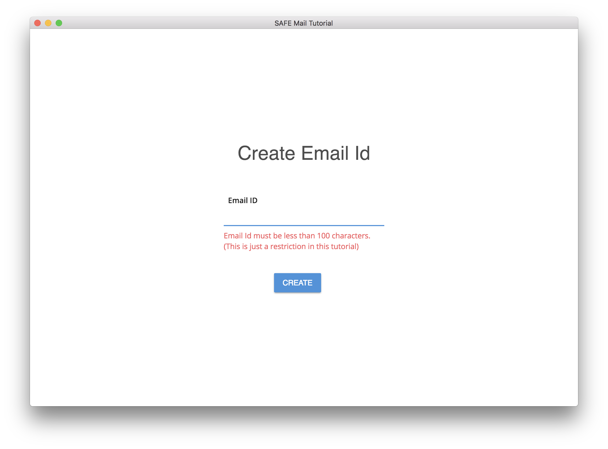

# Create an email ID

The app prompts you to create an email ID (if you hadn't created one yet). An email ID is an identity that you can give to other users in order to receive emails via the SAFE Network. Likewise, to send emails to other SAFE Network users, you need to know their email ID.

#### Contents

<!-- toc -->



> #### info::How is an email ID different from an email address?
>
> An email ID **only works on the SAFE Network**. It's not compatible with traditional email apps such as Gmail. And [existing email addresses](https://en.wikipedia.org/wiki/Email_address) (e.g. *username@example.com*) are not compatible with this app.
>
> Also, since the SAFE Network doesn't use the traditional [Domain Name System](https://en.wikipedia.org/wiki/Domain_Name_System) (the one managed by [ICANN](https://en.wikipedia.org/wiki/ICANN)), the app doesn't need to enforce a specific email format (e.g. username + domain name). Feel free to register any email ID you want.

## Create an appendable data

The app attempts to create a private appendable data with the hash of the email ID you entered. If an appendable data with an ID corresponding to the hash of the email ID you want already exists, you will have to choose another email ID.

This appendable data will be used as your inbox. It has a maximum size of 100 KiB. You can save the emails you want to keep by moving them your root structured data (which has no size limit) and you can delete the emails you don't want to keep by removing them from your appendable data.

Other users will be able to send you emails by appending them to your appendable data. All emails will be encrypted using your public encryption key, therefore only you will be able to read them.

All appendable data items need to have an ID that is 32 bytes long. Therefore, the app generates a 32 bytes long ID by hashing your email ID.

##### [app_utils.js](https://github.com/maidsafe/safe_examples/blob/f1d7510b9a17c05a31da761927e05f17ca9b1c26/email_app/app/utils/app_utils.js#L27-L29)

```js
export const hashEmailId = emailId => {
  return crypto.createHash('sha256').update(emailId).digest('base64');
};
```

#### [Create appendable data](https://github.com/maidsafe/rfcs/blob/master/text/0042-launcher-api-v0.6/api/appendable_data.md#create)

```
POST /appendable-data
```

##### [appendable_data_actions.js](https://github.com/maidsafe/safe_examples/blob/f1d7510b9a17c05a31da761927e05f17ca9b1c26/email_app/app/actions/appendable_data_actions.js#L4-L23)

```js
export const createAppendableData = (token, name) => {
  return {
    type: ACTION_TYPES.CREATE_APPENDABLE_DATA,
    payload: {
      request: {
        method: 'post',
        url: '/appendable-data',
        headers: {
          'Authorization': token
        },
        data: {
          name,
          isPrivate: true,
          filterType: CONSTANTS.APPENDABLE_DATA_FILTER_TYPE.BLACK_LIST,
          filterKeys: []
        }
      }
    }
  };
};
```

### Save the appendable data

The app saves the appendable data to the SAFE Network.

#### [Save AppendableData](https://github.com/maidsafe/rfcs/blob/master/text/0042-launcher-api-v0.6/api/appendable_data.md#save-appendabledata)

```
PUT /appendable-data/:handleId
```

##### [appendable_data_actions.js](https://github.com/maidsafe/safe_examples/blob/f1d7510b9a17c05a31da761927e05f17ca9b1c26/email_app/app/actions/appendable_data_actions.js#L172-L183)

```js
export const putAppendableData = (token, handleId) => ({
  type: ACTION_TYPES.PUT_APPENDABLE_DATA,
  payload: {
    request: {
      method: 'put',
      url: `/appendable-data/${handleId}`,
      headers: {
        'Authorization': token
      }
    }
  }
});
```

### Drop the appendable data handle

After the root structured data is successfully updated, the app drops the appendable data handle.

#### [Drop AppendableData handle](https://github.com/maidsafe/rfcs/blob/master/text/0042-launcher-api-v0.6/api/appendable_data.md#drop-handle)

```
DELETE /appendable-data/handle/:handleId
```

##### [appendable_data_actions.js](https://github.com/maidsafe/safe_examples/blob/f1d7510b9a17c05a31da761927e05f17ca9b1c26/email_app/app/actions/appendable_data_actions.js#L145-L156)

```js
export const dropAppendableDataHandle = (token, handleId) => ({
  type: ACTION_TYPES.DROP_APPENDABLE_DATA_HANDLE,
  payload: {
    request: {
      method: 'delete',
      url: `/appendable-data/handle/${handleId}`,
      headers: {
        'Authorization': token
      }
    }
  }
});
```

## Save the email ID

After the appendable data is successfully created, the app saves your email ID in your root structured data. That way, the app will be able to retrieve your appendable data in the future.

### Get cipher handle

First, the app fetches a "cipher options" handle for symmetric encryption.

#### [Get Cipher-Opts handle](https://github.com/maidsafe/rfcs/blob/master/text/0042-launcher-api-v0.6/api/cipher_opts.md#get-cipher-opts-handle)

```
/cipher-opts/:encType/:keyHandle?
```

##### [cipher-opts_actions.js](https://github.com/maidsafe/safe_examples/blob/f1d7510b9a17c05a31da761927e05f17ca9b1c26/email_app/app/actions/cipher-opts_actions.js#L3-L13)

```js
export const getCipherOptsHandle = (token, encType, keyHandle='') => ({
  type: ACTION_TYPES.GET_CIPHER_OPTS_HANDLE,
  payload: {
    request: {
      url: `/cipher-opts/${encType}/${keyHandle}`,
      headers: {
        'Authorization': token,
      }
    }
  }
});
```

### Update the root structured data

The app adds your email ID to your root structured data and encrypts it using symmetric encryption.

#### [Update StructuredData](https://github.com/maidsafe/rfcs/blob/master/text/0042-launcher-api-v0.6/api/structured_data.md#update-data)

```
PATCH /structured-data/:handleId
```

##### [structured_data_actions.js](https://github.com/maidsafe/safe_examples/blob/f1d7510b9a17c05a31da761927e05f17ca9b1c26/email_app/app/actions/structured_data_actions.js#L63-L78)

```js
export const updateStructuredData = (token, handleId, data, cipherOpts) => ({
  type: ACTION_TYPES.UPDATE_STRUCTURED_DATA,
  payload: {
    request: {
      method: 'patch',
      url: `/structured-data/${handleId}`,
      headers: {
        'Authorization': token
      },
      data: {
        cipherOpts,
        data: new Buffer(JSON.stringify(data)).toString('base64')
      }
    }
  }
});
```

#### Example

If your email ID is **francis**, the JSON data contained in your root structured data would look like this:

```json
{
  "id": "francis",
  "saved": []
}
```

### Drop the cipher handle

The app drops the "cipher options" handle for symmetric encryption.

#### [Drop Cipher-Opts handle](https://github.com/maidsafe/rfcs/blob/master/text/0042-launcher-api-v0.6/api/cipher_opts.md#drop-handle)

```
DELETE /cipher-opts/:handleId
```

##### [cipher-opts_actions.js](https://github.com/maidsafe/safe_examples/blob/f1d7510b9a17c05a31da761927e05f17ca9b1c26/email_app/app/actions/cipher-opts_actions.js#L15-L26)

```js
export const deleteCipherOptsHandle = (token, handleId) => ({
  type: ACTION_TYPES.DELETE_CIPHER_OPTS_HANDLE,
  payload: {
    request: {
      method: 'delete',
      url: `/cipher-opts/${handleId}`,
      headers: {
        'Authorization': token,
      }
    }
  }
});
```

### Save the root structured data

The app saves your root structured data to the SAFE Network.

#### [Save StructuredData](https://github.com/maidsafe/rfcs/blob/master/text/0042-launcher-api-v0.6/api/structured_data.md#save-structured-data)

```
POST /structured-data/:handleId
```

##### [structured_data_actions.js](https://github.com/maidsafe/safe_examples/blob/f1d7510b9a17c05a31da761927e05f17ca9b1c26/email_app/app/actions/structured_data_actions.js#L93-L104)

```js
export const postStructuredData = (token, handleId) => ({
  type: ACTION_TYPES.POST_STRUCTURED_DATA,
  payload: {
    request: {
      method: 'post',
      url: `/structured-data/${handleId}`,
      headers: {
        'Authorization': token
      }
    }
  }
});
```

After your root structured data has been successfully saved, the app transitions to the Inbox page.


