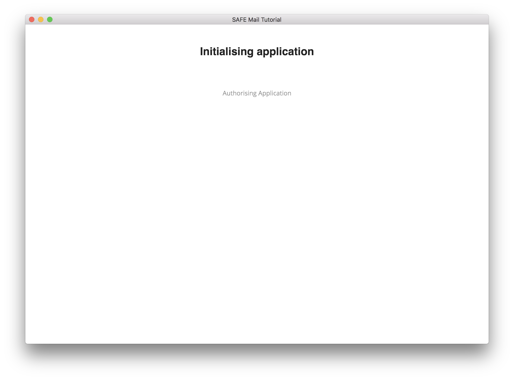
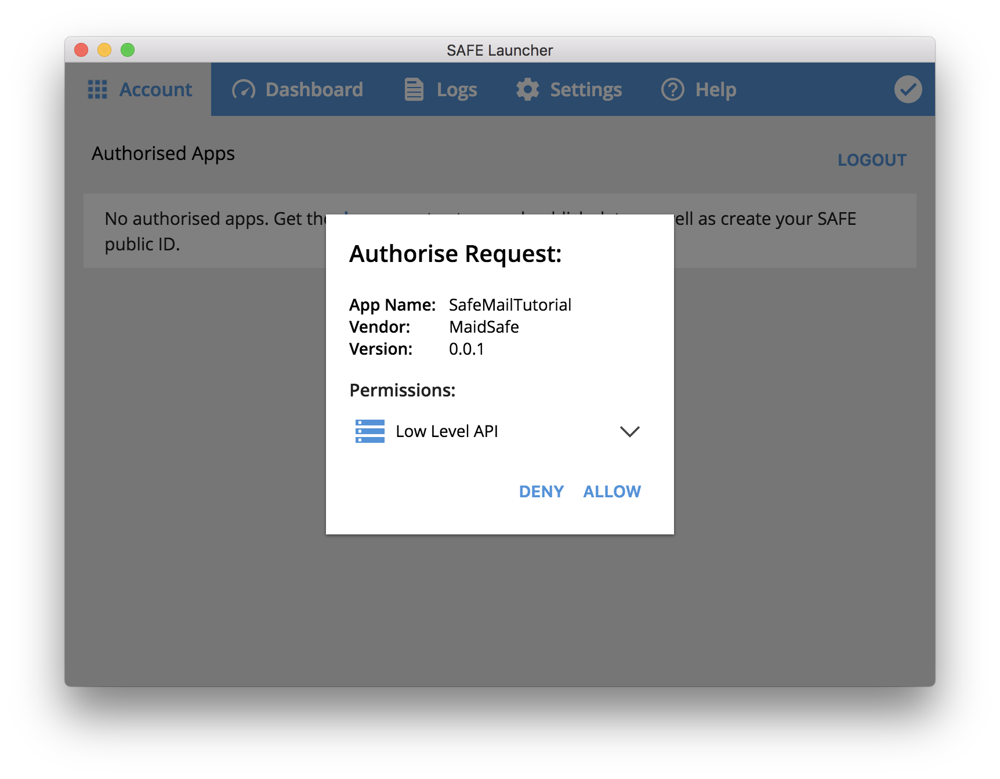

# Initialization

There are multiple tasks that the app needs to do during its initialization. Some of these tasks are only necessary if it's the first time you are authorizing this app with your SAFE Network account.

#### Contents

<!-- toc -->



## Authorize the app

The app sends an [authorization request](https://api.safedev.org/auth/) to SAFE Launcher.

#### [Authorize app](https://api.safedev.org/auth/authorize-app.html)

```
POST /auth
```

##### [initializer_actions.js](https://github.com/maidsafe/safe_examples/blob/3012144cd8f4ab0f5a4891cbbedbdf3de1641755/email_app/app/actions/initializer_actions.js#L8-L19)

```js
export const authoriseApplication = (data) => {
  return {
    type: ACTION_TYPES.AUTHORISE_APP,
    payload: {
      request: {
        method: 'post',
        url: '/auth',
        data: data
      }
    }
  };
};
```

The `authoriseApplication` function is called using `AUTH_PAYLOAD` as an argument:

##### [constants.js](https://github.com/maidsafe/safe_examples/blob/f1d7510b9a17c05a31da761927e05f17ca9b1c26/email_app/app/constants.js#L44-L52)

```js
const AUTH_PAYLOAD = {
  app: {
    name: pkg.productName,
    vendor: pkg.author.name,
    version: pkg.version,
    id: pkg.identifier
  },
  permissions: ['LOW_LEVEL_API']
};
```

The app uses the information contained in its `package.json` file for the following fields:

* app.name
* app.vendor
* app.version
* app.id

Therefore, the request body looks like this:

```json
{
  "app": {
    "name": "SafeMailApp",
    "id": "safe-mail-app",
    "version": "0.0.1",
    "vendor": "MaidSafe"
  },
  "permissions": ["LOW_LEVEL_API"]
}
```

The `LOW_LEVEL_API` permission is requested because the app needs to use the low-level APIs:

- [Structured Data](https://api.safedev.org/low-level-api/structured-data/)
- [Appendable Data](https://api.safedev.org/low-level-api/appendable-data/)
- [Data Identifier](https://api.safedev.org/low-level-api/data-id/)
- [Immutable Data](https://api.safedev.org/low-level-api/immutable-data/)
- [Cipher Options](https://api.safedev.org/low-level-api/cipher-options/)

> #### info::Why is it necessary to ask for this permission?
>
> By providing the `LOW_LEVEL_API` permission, the user should be aware that the app can now store data outside of SAFE Launcher's sandboxing. If the app doesn't properly keep track of the data it creates, the user might be unable to retrieve and delete data stored by the app. For example, it might be possible that some of the data created by the app cannot be deleted by the user. It's the responsibility of the app to keep track of the data it creates using the low-level API.

SAFE Launcher displays a prompt with basic information about the app along with the requested permission (`LOW_LEVEL_API`). You can authorize this request by clicking on "ALLOW".



After you authorize the request, the app receives an authorization token.

> #### info::What is an authorization token?
>
> Authorization tokens are used to invoke APIs that require [authorized access](https://api.safedev.org/auth/#authorized-access). These tokens are session based and thus will be valid only while SAFE Launcher is running.

## Check if a config file is present

The app needs a way to store your email data on the SAFE Network. Using the [Structured Data API](https://api.safedev.org/low-level-api/structured-data/), you can create a private structured data that will be used by the app to store your email ID and your saved emails. Let's call it the "root structured data".

Your root structured data is created using a random ID. In order to be able to retrieve your root structured data later, you need to store its ID in a config file. This config file will be stored in the app's root directory.

During the initialization process, if the app detects that you already have a config file, it will try to fetch your root structured data. If you don't have a config file, the app will create one for you.

To check if there's a config file in its root directory, the app attempts to retrieve a file called "config".

#### [Get file](https://api.safedev.org/nfs/file/get-file.html)

```
GET /nfs/file/:rootPath/:filePath
```

##### [nfs_actions.js](https://github.com/maidsafe/safe_examples/blob/3012144cd8f4ab0f5a4891cbbedbdf3de1641755/email_app/app/actions/nfs_actions.js#L21-L35)

```js
export const getConfigFile = token => {
  return {
    type: ACTION_TYPES.GET_CONFIG_FILE,
    payload: {
      request: {
        url: `/nfs/file/${CONSTANTS.ROOT_PATH}/config`,
        headers: {
          'Authorization': token,
          Range: 'bytes=0-'
        },
        responseType: 'arraybuffer'
      }
    }
  };
};
```

<!-- *(Should we explain why we just fetch the first byte of the config file?)* -->

## If a config file is not found

The app will create a root structured data with a random ID. All structured data items need to have an ID that is 32 bytes long. Therefore, the app generates a 32 bytes long random ID using this function:

##### [app_utils.js](https://github.com/maidsafe/safe_examples/blob/f1d7510b9a17c05a31da761927e05f17ca9b1c26/email_app/app/utils/app_utils.js#L31-L33)

```js
export const generateStructredDataId = () => {
  return base64.encode(crypto.randomBytes(32).toString('base64'));
};
```

The root structured data will be used to store your email ID and your saved emails. Since we use an unversioned structured data, you can store as many emails as you want.

The email data can be represented using a simple [JSON](https://en.wikipedia.org/wiki/JSON) format:

```json
{
  "id": "",
  "saved": []
}
```

### Get a cipher options handle

First, the app fetches a cipher options handle for symmetric encryption.

#### [Get cipher options handle](https://api.safedev.org/low-level-api/cipher-options/get-cipher-options-handle.html)

```
/cipher-opts/:encType/:keyHandle?
```

##### [cipher-opts_actions.js](https://github.com/maidsafe/safe_examples/blob/f1d7510b9a17c05a31da761927e05f17ca9b1c26/email_app/app/actions/cipher-opts_actions.js#L3-L13)

```js
export const getCipherOptsHandle = (token, encType, keyHandle='') => ({
  type: ACTION_TYPES.GET_CIPHER_OPTS_HANDLE,
  payload: {
    request: {
      url: `/cipher-opts/${encType}/${keyHandle}`,
      headers: {
        'Authorization': token,
      }
    }
  }
});
```

### Create a root structured data

Your root structured data is encrypted using symmetric encryption. This means that no one else can read its content. Only you can decrypt it. Also, since we don't need versioning (we only want to show the latest data), we create an [unversioned structured data](https://github.com/maidsafe/rfcs/blob/master/text/0042-launcher-api-v0.6/api/structured_data.md#create) (type 500).

#### [Create structured data](https://api.safedev.org/low-level-api/structured-data/create-structured-data.html)

```
POST /structured-data
```

##### [structured_data_actions.js](https://github.com/maidsafe/safe_examples/blob/f1d7510b9a17c05a31da761927e05f17ca9b1c26/email_app/app/actions/structured_data_actions.js#L4-L21)

```js
export const createStructuredData = (token, name, data, cipherHandle) => ({
  type: ACTION_TYPES.CREATE_STRUCTURED_DATA,
  payload: {
    request: {
      method: 'post',
      url: '/structured-data',
      headers: {
        'Authorization': token
      },
      data: {
        name,
        typeTag: CONSTANTS.TAG_TYPE.DEFAULT,
        cipherOpts: cipherHandle,
        data: new Buffer(JSON.stringify(data)).toString('base64')
      }
    }
  }
});
```

### Drop the cipher handle

The app drops the "cipher options" handle for symmetric encryption.

#### [Drop Cipher-Opts handle](https://github.com/maidsafe/rfcs/blob/master/text/0042-launcher-api-v0.6/api/cipher_opts.md#drop-handle)

```
DELETE /cipher-opts/:handleId
```

##### [cipher-opts_actions.js](https://github.com/maidsafe/safe_examples/blob/f1d7510b9a17c05a31da761927e05f17ca9b1c26/email_app/app/actions/cipher-opts_actions.js#L15-L26)

```js
export const deleteCipherOptsHandle = (token, handleId) => ({
  type: ACTION_TYPES.DELETE_CIPHER_OPTS_HANDLE,
  payload: {
    request: {
      method: 'delete',
      url: `/cipher-opts/${handleId}`,
      headers: {
        'Authorization': token,
      }
    }
  }
});
```

### Save the root structured data

The app saves your root structured data to the SAFE Network.

#### [Save structured data](https://api.safedev.org/low-level-api/structured-data/save-structured-data.html#put-endpoint)

```
PUT /structured-data/:handleId
```

##### [structured_data_actions.js](https://github.com/maidsafe/safe_examples/blob/f1d7510b9a17c05a31da761927e05f17ca9b1c26/email_app/app/actions/structured_data_actions.js#L106-L117)

```js
export const putStructuredData = (token, handleId) => ({
  type: ACTION_TYPES.PUT_STRUCTURED_DATA,
  payload: {
    request: {
      method: 'put',
      url: `/structured-data/${handleId}`,
      headers: {
        'Authorization': token
      }
    }
  }
});
```

### Create a config file

After your root structured data is successfully created, the app stores its ID in a config file. That way, the app will be able to retrieve your email data in the future.

This config file is stored in the app's root directory, which is private. Therefore, it will automatically be encrypted and no one else will be able to read it.

#### [Create file](https://api.safedev.org/nfs/file/create-file.html)

```
POST /nfs/file/:rootPath/:filePath
```

##### [nfs_actions.js](https://github.com/maidsafe/safe_examples/blob/3012144cd8f4ab0f5a4891cbbedbdf3de1641755/email_app/app/actions/nfs_actions.js#L4-L19)

```js
export const writeConfigFile = (token, coreId) => {
  return {
    type: ACTION_TYPES.WRITE_CONFIG_FILE,
    payload: {
      request: {
        method: 'post',
        url: `/nfs/file/${CONSTANTS.ROOT_PATH}/config`,
        headers: {
          'Authorization': token,
          'Content-Type': 'plain/text'
        },
        data: new Uint8Array(Buffer(coreId))
      }
    }
  }
};
```

After the config file is successfully created, the app transitions to the Create Account page.


## If a config file is found

The app will fetch your email data (email ID and saved emails) using the ID stored in the config file.

### Get a data identifier handle

First, the app fetches a data identifier handle using the ID of your root structured data.

<!-- *(explain why handles are needed?)* -->

#### [Get DataIdentifier handle for StructuredData](https://github.com/maidsafe/rfcs/blob/master/text/0042-launcher-api-v0.6/api/data_identifier.md#get-dataidentifier-for-structureddata)

```
POST /data-id/structured-data
```

##### [data_id_handle_actions.js](https://github.com/maidsafe/safe_examples/blob/b74eb5f4f1181ecfc4a5e69a01fa3f2b6f54ecd6/email_app/app/actions/data_id_handle_actions.js#L4-L19)

```js
export const getStructuredDataIdHandle = (token, name, typeTag) => ({
  type: ACTION_TYPES.GET_STRUCTURED_DATA_ID_HANDLE,
  payload: {
    request: {
      method: 'post',
      url: '/data-id/structured-data',
      headers: {
        'Authorization': token
      },
      data: {
        typeTag,
        name
      }
    }
  }
});
```

### Get a structured data handle

The app fetches a structured data handle using the data identifier handle of your root structured data.

#### [Get structured data handle](https://api.safedev.org/low-level-api/structured-data/get-structured-data-handle.html)

```
GET /structured-data/handle/:dataIdHandle
```

##### [structured_data_actions.js](https://github.com/maidsafe/safe_examples/blob/b74eb5f4f1181ecfc4a5e69a01fa3f2b6f54ecd6/email_app/app/actions/structured_data_actions.js#L36-L46)

```js
export const fetchStructuredDataHandle = (token, dataIdHandle) => ({
  type: ACTION_TYPES.FETCH_STRUCTURE_DATA_HANDLE,
  payload: {
    request: {
      url: `/structured-data/handle/${dataIdHandle}`,
      headers: {
        'Authorization': token
      }
    }
  }
});
```

### Fetch the root structured data

After the structured data handle is successfully retrieved, the app fetches the structured data that contains your email data.

#### [Read structured data](https://api.safedev.org/low-level-api/structured-data/read-structured-data.html)

```
GET /structured-data/:handleId/:version?
```

##### [structured_data_actions.js](https://github.com/maidsafe/safe_examples/blob/b74eb5f4f1181ecfc4a5e69a01fa3f2b6f54ecd6/email_app/app/actions/structured_data_actions.js#L23-L34)

```js
export const fetchStructuredData = (token, handleId) => ({
  type: ACTION_TYPES.FETCH_STRUCTURED_DATA,
  payload: {
    request: {
      url: `/structured-data/${handleId}`,
      headers: {
        'Authorization': token,
        'Content-Type': 'text/plain'
      }
    }
  }
});
```

#### If the structured data doesn't contain an email ID

If you hadn't created an email ID yet, the app transitions to the Create Account page.


#### If the structured data contains an email ID

If you had already created an email ID, the app transitions to the Inbox page.


