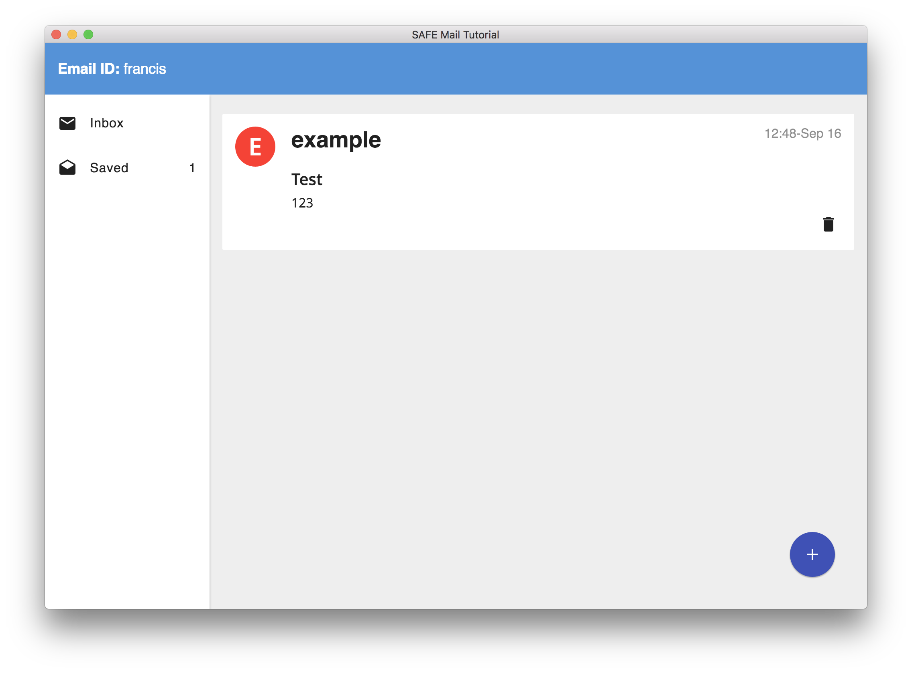

# Save an email

Your appendable data has a maximum size of 100 KiB. You can save the emails you want to keep by adding them your root structured data (which has no size limit). After you save an email, the app deletes that email from your appendable data. Therefore, it won't show up in your inbox anymore.

#### Contents

<!-- toc -->



## Add the email to the root stuctured data

When you click on the "Save" button, the app adds the email you want to save to your saved folder and removes it from your inbox folder.

### Update the root structured data

The app updates your root structured data (which now contains the email you just saved) and encrypts it using symmetric encryption.

#### [Update StructuredData](https://github.com/maidsafe/rfcs/blob/master/text/0042-launcher-api-v0.6/api/structured_data.md#update-data)

```
PATCH /structured-data/:handleId
```

##### [structured_data_actions.js](https://github.com/maidsafe/safe_examples/blob/f1d7510b9a17c05a31da761927e05f17ca9b1c26/email_app/app/actions/structured_data_actions.js#L63-L78)

```js
export const updateStructuredData = (token, handleId, data, cipherOpts) => ({
  type: ACTION_TYPES.UPDATE_STRUCTURED_DATA,
  payload: {
    request: {
      method: 'patch',
      url: `/structured-data/${handleId}`,
      headers: {
        'Authorization': token
      },
      data: {
        cipherOpts,
        data: new Buffer(JSON.stringify(data)).toString('base64')
      }
    }
  }
});
```

### Save the root structured data

The app saves your root structured data to the SAFE Network.

#### [Save structured data](https://api.safedev.org/low-level-api/structured-data/save-structured-data.html#put-endpoint)

```
POST /structured-data/:handleId
```

##### [structured_data_actions.js](https://github.com/maidsafe/safe_examples/blob/f1d7510b9a17c05a31da761927e05f17ca9b1c26/email_app/app/actions/structured_data_actions.js#L93-L104)

```js
export const postStructuredData = (token, handleId) => ({
  type: ACTION_TYPES.POST_STRUCTURED_DATA,
  payload: {
    request: {
      method: 'post',
      url: `/structured-data/${handleId}`,
      headers: {
        'Authorization': token
      }
    }
  }
});
```

## Get the appendable data of the inbox folder

The app needs to obtain an appendable data handle.

### Get a data identifier handle

First, the app fetches a data identifier handle for the appendable data representing your inbox folder.

#### [Get DataIdentifier for AppendableData](https://github.com/maidsafe/rfcs/blob/master/text/0042-launcher-api-v0.6/api/data_identifier.md#get-dataidentifier-for-appendabledata)

```
POST /data-id/appendable-data
```

##### [data_id_handle_actions.js](https://github.com/maidsafe/safe_examples/blob/f1d7510b9a17c05a31da761927e05f17ca9b1c26/email_app/app/actions/data_id_handle_actions.js#L22-L37)

```js
export const getAppendableDataIdHandle = (token, name) => ({
  type: ACTION_TYPES.GET_STRUCTURED_DATA_ID_HANDLE,
  payload: {
    request: {
      method: 'post',
      url: '/data-id/appendable-data',
      headers: {
        'Authorization': token
      },
      data: {
        isPrivate: true,
        name
      }
    }
  }
});
```

The name of the appendable data is obtained by hashing your email ID:

##### [app_utils.js](https://github.com/maidsafe/safe_examples/blob/f1d7510b9a17c05a31da761927e05f17ca9b1c26/email_app/app/utils/app_utils.js#L27-L29)

```js
export const hashEmailId = emailId => {
  return crypto.createHash('sha256').update(emailId).digest('base64');
};
```

### Get an appendable data handle

The app fetches an appendable data handle using the data identifier handle representing your inbox folder.

#### [Get AppendableData handle](https://github.com/maidsafe/rfcs/blob/master/text/0042-launcher-api-v0.6/api/appendable_data.md#get-appendabledata-handle-from-dataidentifier-handle)

```
GET /appendable-data/handle/:dataIdHandle
```

##### [appendable_data_actions.js](https://github.com/maidsafe/safe_examples/blob/f1d7510b9a17c05a31da761927e05f17ca9b1c26/email_app/app/actions/appendable_data_actions.js#L39-L52)

```js
export const fetchAppendableDataHandle = (token, dataIdHandle) => { // id => appendable data id
  return {
    type: ACTION_TYPES.FETCH_APPENDABLE_DATA_HANDLER,
    payload: {
      request: {
        url: `/appendable-data/handle/${dataIdHandle}`,
        headers: {
          'Authorization': token,
          'Is-Private': true
        }
      }
    }
  };
};
```

### Drop the data identifier handle

The app drops the data identifier handle for the appendable data representing your inbox folder.

#### [Drop handle](https://github.com/maidsafe/rfcs/blob/master/text/0042-launcher-api-v0.6/api/data_identifier.md#drop-handle)

```
DELETE /data-id/:handleId
```

##### [data_id_handle_actions.js](https://github.com/maidsafe/safe_examples/blob/f1d7510b9a17c05a31da761927e05f17ca9b1c26/email_app/app/actions/data_id_handle_actions.js#L67-L78)

```js
export const dropHandler = (token, handleId) => ({
  type: ACTION_TYPES.DROP_HANDLER,
  payload: {
    request: {
      method: 'delete',
      url: `/data-id/${handleId}`,
      headers: {
        'Authorization': token
      }
    }
  }
});
```

## Remove the email from the appendable data

The app removes the email you just saved from your appendable data. This moves the email to the `deleted_data` field of the appendable data.

#### [Remove from data by index](https://github.com/maidsafe/rfcs/blob/master/text/0042-launcher-api-v0.6/api/appendable_data.md#remove-from-data-by-index)

```
DELETE /appendable-data/:handleId/:index
```

##### [appendable_data_actions.js](https://github.com/maidsafe/safe_examples/blob/f1d7510b9a17c05a31da761927e05f17ca9b1c26/email_app/app/actions/appendable_data_actions.js#L91-L104)

```js
export const removeFromAppendableData = (token, handleId, index) => {
  return {
    type: ACTION_TYPES.REMOVE_FROM_APPENDABLE_DATA,
    payload: {
      request: {
        method: 'delete',
        url: `/appendable-data/${handleId}/${index}`,
        headers: {
          'Authorization': token
        }
      }
    }
  };
};
```

### Save the appendable data

The app saves your appendable data by sending a POST request to the SAFE Network.

#### [Save AppendableData](https://github.com/maidsafe/rfcs/blob/master/text/0042-launcher-api-v0.6/api/appendable_data.md#save-appendabledata)

```
POST /appendable-data/:handleId
```

##### [appendable_data_actions.js](https://github.com/maidsafe/safe_examples/blob/f1d7510b9a17c05a31da761927e05f17ca9b1c26/email_app/app/actions/appendable_data_actions.js#L159-L170)

```js
export const postAppendableData = (token, handleId) => ({
  type: ACTION_TYPES.POST_APPENDABLE_DATA,
  payload: {
    request: {
      method: 'post',
      url: `/appendable-data/${handleId}`,
      headers: {
        'Authorization': token
      }
    }
  }
});
```

### Clear the deleted data of the appendable data

The app clears the `deleted_data` field of your appendable data.

#### [Clear deleted data section](https://github.com/maidsafe/rfcs/blob/master/text/0042-launcher-api-v0.6/api/appendable_data.md#clear-deleted-data-section)

```
DELETE /appendable-data/clear-deleted-data/:handleId
```

##### [appendable_data_actions.js](https://github.com/maidsafe/safe_examples/blob/f1d7510b9a17c05a31da761927e05f17ca9b1c26/email_app/app/actions/appendable_data_actions.js#L119-L130)

```js
export const clearDeletedData = (token, handleId) => ({
  type: ACTION_TYPES.CLEAR_DELETE_DATA,
  payload: {
    request: {
      method: 'delete',
      url: `/appendable-data/clear-deleted-data/${handleId}`,
      headers: {
        'Authorization': token
      }
    }
  }
});
```

### Save the appendable data (again)

The app saves your appendable data by sending a POST request to the SAFE Network.

#### [Save AppendableData](https://github.com/maidsafe/rfcs/blob/master/text/0042-launcher-api-v0.6/api/appendable_data.md#save-appendabledata)

```
POST /appendable-data/:handleId
```

##### [appendable_data_actions.js](https://github.com/maidsafe/safe_examples/blob/f1d7510b9a17c05a31da761927e05f17ca9b1c26/email_app/app/actions/appendable_data_actions.js#L159-L170)

```js
export const postAppendableData = (token, handleId) => ({
  type: ACTION_TYPES.POST_APPENDABLE_DATA,
  payload: {
    request: {
      method: 'post',
      url: `/appendable-data/${handleId}`,
      headers: {
        'Authorization': token
      }
    }
  }
});
```

### Drop the appendable data handle

The app drops the appendable data handle and [refreshes the inbox folder](refresh-the-inbox-folder.md).

#### [Drop AppendableData handle](https://github.com/maidsafe/rfcs/blob/master/text/0042-launcher-api-v0.6/api/appendable_data.md#drop-handle)

```
DELETE /appendable-data/handle/:handleId
```

##### [appendable_data_actions.js](https://github.com/maidsafe/safe_examples/blob/f1d7510b9a17c05a31da761927e05f17ca9b1c26/email_app/app/actions/appendable_data_actions.js#L145-L156)

```js
export const dropAppendableDataHandle = (token, handleId) => ({
  type: ACTION_TYPES.DROP_APPENDABLE_DATA_HANDLE,
  payload: {
    request: {
      method: 'delete',
      url: `/appendable-data/handle/${handleId}`,
      headers: {
        'Authorization': token
      }
    }
  }
});
```
