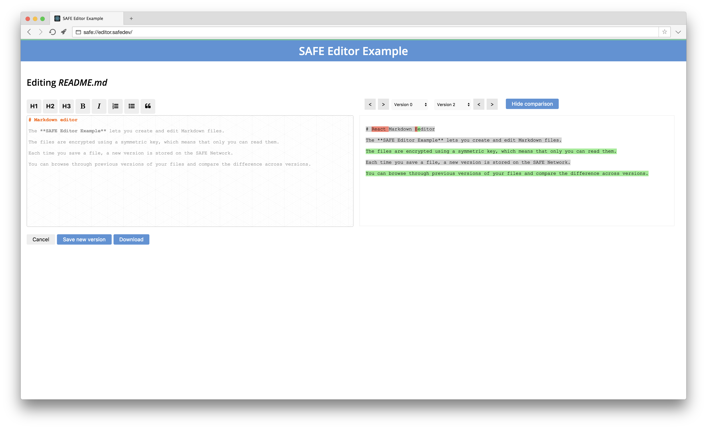

# Markdown editor

In this tutorial, you will learn how to build **a text editor that stores its data on the SAFE Network**.

The **SAFE Editor Example** lets you create and edit Markdown files. The files are encrypted using a symmetric key, which means that only you can read them. Each time you save a file, a new version is stored on the SAFE Network. You can browse through previous versions of your files and compare the difference across versions. This example demonstrates the usage of [versioned structured data](https://api.safedev.org/v/0.6/low-level-api/structured-data/).

#### Contents

<!-- toc -->



## Overview

This tutorial will showcase how to:

- [Load file index](load-file-index.md)
- [Create a file](create-a-file.md)
- [Edit a file](edit-a-file.md)
- [Save a new version](save-a-new-version.md)
- [Load file versions](load-file-versions.md)

### SAFE APIs

You will learn about the following APIs:

- [Authorization](https://api.safedev.org/auth/)
- [NFS](https://api.safedev.org/nfs/)
- [Structured Data](https://github.com/maidsafe/rfcs/blob/master/text/0042-launcher-api-v0.6/api/structured_data.md)
- [Data ID](https://github.com/maidsafe/rfcs/blob/master/text/0042-launcher-api-v0.6/api/data_identifier.md)
- [Cipher Options](https://github.com/maidsafe/rfcs/blob/master/text/0042-launcher-api-v0.6/api/cipher_opts.md)

#### External libraries

- [React](https://facebook.github.io/react/)
- [React Markdown Editor](https://github.com/JedWatson/react-md-editor)
- [react-diff](https://github.com/cezary/react-diff)

## Source code

[Browse **the source code of the SAFE Editor Example** on GitHub](https://github.com/maidsafe/safe_examples/tree/master/versioning_editor)

[create-react-app](https://github.com/facebookincubator/create-react-app) was used as a starting point.

### Live version

You can access the **SAFE Editor Example** at **[safe://editor.safedev](safe://editor.safedev)** using [SAFE Browser v0.4.0-5](https://github.com/joshuef/beaker/releases/tag/v0.4.0-5).

### Development mode

#### Requirements

##### 1. SAFE Launcher

Start [SAFE Launcher v0.9.3](https://github.com/maidsafe/safe_launcher/releases/tag/0.9.3) and log in.

##### 2. SAFE Browser

Start [SAFE Browser v0.4.0-5](https://github.com/joshuef/beaker/releases/tag/v0.4.0-5).

##### 3. Node.js

Make sure you have Node.js v6 (LTS).

```
node --version
```

There are many ways to install Node.js. See [nodejs.org](https://nodejs.org/en/download/) for more info.

#### Setup

##### 1. Clone [this GitHub repository](https://github.com/maidsafe/safe_examples)

```
git clone https://github.com/maidsafe/safe_examples.git
```

If you don't have Git installed, you can download it from [git-scm.com](https://git-scm.com/downloads).

##### 2. Install the dependencies

```
cd safe_examples/versioning_editor && npm install
```

##### 3. Start the app

```
npm run start
```
