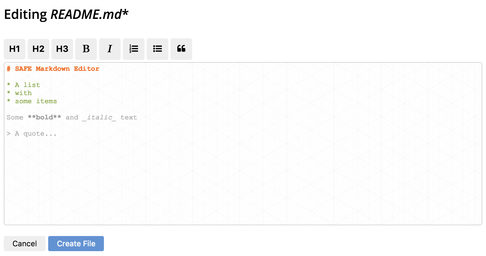

# Create a file

#### Contents

<!-- toc -->



##### [store.js](https://github.com/shankar2105/safe_examples_private/blob/ben_versioning_editor/versioning_editor/src/store.js#L111-L114)

```js
const payload = new Buffer(JSON.stringify({
  ts: (new Date()).getTime(),
  content: data
})).toString('base64');
```

##### [store.js](https://github.com/shankar2105/safe_examples_private/blob/ben_versioning_editor/versioning_editor/src/store.js#L122-L126)

```js
safeStructuredData.create(ACCESS_TOKEN,
  // trying to come up with a name that is super unlikely to clash ever.
  btoa(`${USER_PREFIX}:${filename}`),
  // 501 => we want this versioned
  501, payload, SYMETRIC_CYPHER_HANDLE)
```

##### [store.js](https://github.com/shankar2105/safe_examples_private/blob/ben_versioning_editor/versioning_editor/src/store.js#L129)

```js
safeStructuredData.put(ACCESS_TOKEN, handle)
```

##### [store.js](https://github.com/shankar2105/safe_examples_private/blob/ben_versioning_editor/versioning_editor/src/store.js#L131)

```js
safeStructuredData.getDataIdHandle(ACCESS_TOKEN, handle)
```

##### [store.js](https://github.com/shankar2105/safe_examples_private/blob/ben_versioning_editor/versioning_editor/src/store.js#L134)

```js
FILE_INDEX[filename] = dataHandleId;
```

##### [store.js](https://github.com/shankar2105/safe_examples_private/blob/ben_versioning_editor/versioning_editor/src/store.js#L103-L106)

```js
safeStructuredData.updateData(ACCESS_TOKEN,
  INDEX_HANDLE,
  new Buffer(JSON.stringify(FILE_INDEX)).toString('base64'),
  SYMETRIC_CYPHER_HANDLE)
```

##### [store.js](https://github.com/shankar2105/safe_examples_private/blob/ben_versioning_editor/versioning_editor/src/store.js#L107)

```js
safeStructuredData.post(ACCESS_TOKEN, INDEX_HANDLE)
```

## Load file index

Reload file index

## Load file versions

Load file versions


