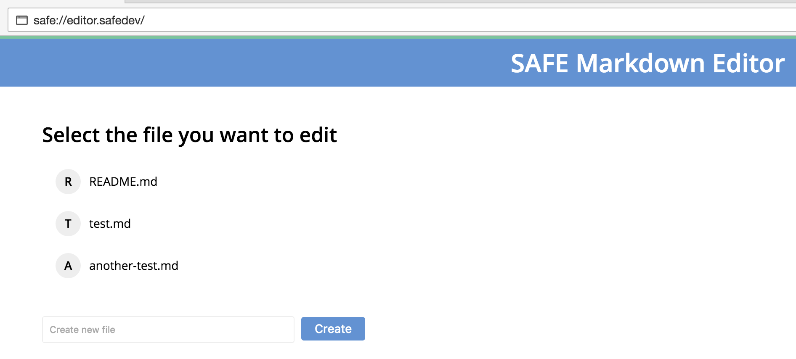

# Create a file

Each Markdown file you create will be stored inside a new [versioned structured data](https://api.safedev.org/low-level-api/structured-data/). In order for you to be able to retrieve your files, the app needs to add the filename of each file you create to your file index.

#### Contents

<!-- toc -->


## Create file

The app creates a versioned structured data (type tag 501) with an ID based on your user prefix and the filename. This structured data will contain all the different versions of your file. The first version is encrypted using the cipher options handle previously obtained.

#### [Create structured data](https://api.safedev.org/low-level-api/structured-data/create-structured-data.html)

```
POST /structured-data
```

##### [store.js](https://github.com/maidsafe/safe_examples/blob/6f740f79ce30349c2b94252d6856927375bf3dbe/markdown_editor/src/store.js#L122-L126)

```js
safeStructuredData.create(ACCESS_TOKEN,
  // trying to come up with a name that is super unlikely to clash ever.
  btoa(`${USER_PREFIX}:${filename}`),
  // 501 => we want this versioned
  501, payload, SYMETRIC_CYPHER_HANDLE)
```

Each version includes the Markdown content and the current time (encoded as a base 64 string).

##### [store.js](https://github.com/maidsafe/safe_examples/blob/6f740f79ce30349c2b94252d6856927375bf3dbe/markdown_editor/src/store.js#L111-L114)

```js
const payload = new Buffer(JSON.stringify({
  ts: (new Date()).getTime(),
  content: data
})).toString('base64');
```

The app saves the first version of your file by sending a PUT request to the SAFE Network.

#### [Save structured data](https://api.safedev.org/low-level-api/structured-data/save-structured-data.html#put-endpoint)

```
PUT /structured-data/:handleId
```

##### [store.js](https://github.com/maidsafe/safe_examples/blob/6f740f79ce30349c2b94252d6856927375bf3dbe/markdown_editor/src/store.js#L129)

```js
safeStructuredData.put(ACCESS_TOKEN, handle)
```

## Get a data ID handle

The app obtains a data ID handle for the versioned structured data that contains the file you just created.

#### [Get data ID handle](https://api.safedev.org/low-level-api/structured-data/get-data-id-handle.html)

```
GET /structured-data/data-id/:handleId
```

##### [store.js](https://github.com/maidsafe/safe_examples/blob/6f740f79ce30349c2b94252d6856927375bf3dbe/markdown_editor/src/store.js#L131)

```js
safeStructuredData.getDataIdHandle(ACCESS_TOKEN, handle)
```

The app adds the filename and the data ID handle to the global variable representing your file index.

##### [store.js](https://github.com/maidsafe/safe_examples/blob/6f740f79ce30349c2b94252d6856927375bf3dbe/markdown_editor/src/store.js#L134)

```js
FILE_INDEX[filename] = dataHandleId;
```

## Update the file index

The app updates the structured data that contains your file index. The updated file index contains the name of the file you just created.

#### [Update structured data](https://api.safedev.org/low-level-api/structured-data/update-structured-data.html)

```
PATCH /structured-data/:handleId
```

##### [store.js](https://github.com/maidsafe/safe_examples/blob/6f740f79ce30349c2b94252d6856927375bf3dbe/markdown_editor/src/store.js#L103-L106)

```js
safeStructuredData.updateData(ACCESS_TOKEN,
  INDEX_HANDLE,
  new Buffer(JSON.stringify(FILE_INDEX)).toString('base64'),
  SYMETRIC_CYPHER_HANDLE)
```

The app saves your file index by sending a POST request to the SAFE Network.

#### [Save structured data](https://api.safedev.org/low-level-api/structured-data/save-structured-data.html#post-endpoint)

```
POST /structured-data/:handleId
```

##### [store.js](https://github.com/maidsafe/safe_examples/blob/6f740f79ce30349c2b94252d6856927375bf3dbe/markdown_editor/src/store.js#L107)

```js
safeStructuredData.post(ACCESS_TOKEN, INDEX_HANDLE)
```

## Fetch file index

The app [refetches your file index](fetch-file-index.md) in order to update the list of files in the UI.


