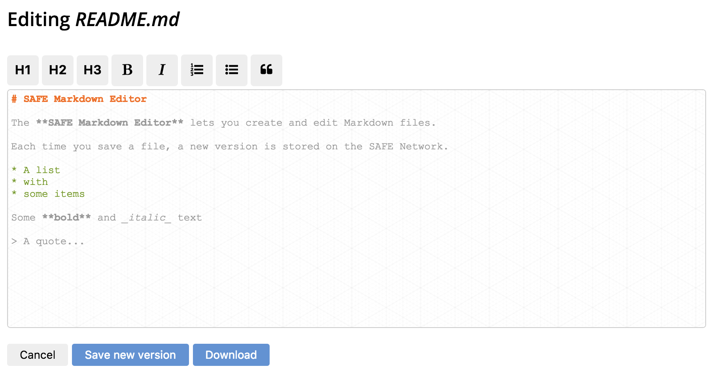

# Edit a file

When you want to edit an existing file, the app needs to load the content of that file.

#### Contents

<!-- toc -->



## Get a data ID handle

The app obtains a data ID handle for the versioned structured data (type tag 501) that contains the file you want to edit. The ID of this structured data is based on your user prefix and the name of the file.

#### [Get data ID handle for structured data](https://api.safedev.org/low-level-api/data-id/get-data-id-handle.html#for-structured-data)

```
POST /data-id/structured-data
```

##### [store.js](https://github.com/maidsafe/safe_examples/blob/6f740f79ce30349c2b94252d6856927375bf3dbe/markdown_editor/src/store.js#L55)

```js
safeDataId.getStructuredDataHandle(ACCESS_TOKEN, btoa(`${USER_PREFIX}:${filename}`), 501)
```

## Get a structured data handle

The app obtains a structured data handle using the data ID handle of the file you want to edit.

#### [Get structured data handle](https://api.safedev.org/low-level-api/structured-data/get-structured-data-handle.html)

```
GET /structured-data/handle/:dataIdHandle
```

##### [store.js](https://github.com/maidsafe/safe_examples/blob/6f740f79ce30349c2b94252d6856927375bf3dbe/markdown_editor/src/store.js#L58)

```js
safeStructuredData.getHandle(ACCESS_TOKEN, dataIdHandle)
```

After obtaining a structured data handle, the app drops the data ID handle of the file you want to edit.

#### [Drop data ID handle](https://api.safedev.org/low-level-api/data-id/drop-data-id-handle.html)

```
DELETE /data-id/:handleId
```

##### [store.js](https://github.com/maidsafe/safe_examples/blob/6f740f79ce30349c2b94252d6856927375bf3dbe/markdown_editor/src/store.js#L61)

```js
safeDataId.dropHandle(ACCESS_TOKEN, dataIdHandle)
```

## Fetch the file

The app reads the latest version of the structured data using the structured data handle of the file you want to edit.

#### [Read structured data](https://api.safedev.org/low-level-api/structured-data/read-structured-data.html)

```
GET /structured-data/:handleId/:version?
```

##### [store.js](https://github.com/maidsafe/safe_examples/blob/6f740f79ce30349c2b94252d6856927375bf3dbe/markdown_editor/src/store.js#L183)

```js
safeStructuredData.readData(ACCESS_TOKEN, handleId, version)
```

The app displays the Markdown content for the latest version of the file you want to edit.


## Fetch all versions

The app [fetches all the versions](fetch-all-version.dm) of the file and displays them in the UI.


