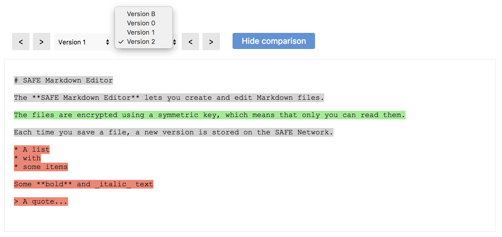

# Fetch all versions

The app fetches all the versions of the file you opened.

#### Contents

<!-- toc -->



## Get a data ID handle

The app obtains a data ID handle for the versioned structured data (type tag 501) that contains the file you opened. The ID of this structured data is based on your user prefix and the name of the file.

#### [Get data ID handle for structured data](https://api.safedev.org/low-level-api/data-id/get-data-id-handle.html#for-structured-data)

```
POST /data-id/structured-data
```

##### [store.js](https://github.com/shankar2105/safe_examples_private/blob/ben_versioning_editor/versioning_editor/src/store.js#L55)

```js
safeDataId.getStructuredDataHandle(ACCESS_TOKEN, btoa(`${USER_PREFIX}:${filename}`), 501)
```

## Get a structured data handle

The app obtains a structured data handle using the data ID handle of the file you opened.

#### [Get structured data handle](https://api.safedev.org/low-level-api/structured-data/get-structured-data-handle.html)

```
GET /structured-data/handle/:dataIdHandle
```

##### [store.js](https://github.com/shankar2105/safe_examples_private/blob/ben_versioning_editor/versioning_editor/src/store.js#L58)

```js
safeStructuredData.getHandle(ACCESS_TOKEN, dataIdHandle)
```

After obtaining a structured data handle, the app drops the data ID handle of the file you opened.

#### [Drop data ID handle](https://api.safedev.org/low-level-api/data-id/drop-data-id-handle.html)

```
DELETE /data-id/:handleId
```

##### [store.js](https://github.com/shankar2105/safe_examples_private/blob/ben_versioning_editor/versioning_editor/src/store.js#L61)

```js
safeDataId.dropHandle(ACCESS_TOKEN, dataIdHandle)
```

## Fetch the metadata of the file

The app fetches the metadata of the structured data that contains all the versions of the file you opened.

#### [Get structured data metadata](https://api.safedev.org/low-level-api/structured-data/get-structured-data-metadata.html)

```
GET /structured-data/metadata/:handleId
```

##### [store.js](https://github.com/shankar2105/safe_examples_private/blob/ben_versioning_editor/versioning_editor/src/store.js#L190)

```js
safeStructuredData.getMetadata(ACCESS_TOKEN, sdHandleId)
```

The app now knows the number of versions contained inside the structured data.

## Fetch each version

The app reads each version of the structured data one by one.

#### [Read structured data](https://api.safedev.org/low-level-api/structured-data/read-structured-data.html)

```
GET /structured-data/:handleId/:version?
```

##### [store.js](https://github.com/shankar2105/safe_examples_private/blob/ben_versioning_editor/versioning_editor/src/store.js#L197)

```js
safeStructuredData.readData(ACCESS_TOKEN, sdHandleId, version)
```

After reading all the versions of the file you opened, the app displays them in the UI.


