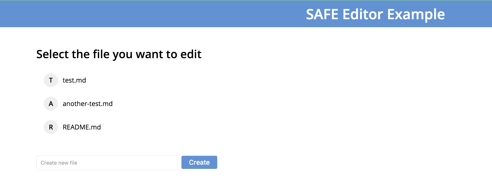

# Fetch file index

The app fetches the file index associated with your user prefix. Each Markdown file you create is stored inside a new [structured data](https://api.safedev.org/low-level-api/structured-data/). The ID of each file is based on your user prefix and the filename. The file index contains the names of all your files. Individual files can be fetched using your user prefix and the filename.

#### Contents

<!-- toc -->



#### [Get data ID handle for structured data](https://api.safedev.org/low-level-api/data-id/get-data-id-handle.html#for-structured-data)

```
POST /data-id/structured-data
```

##### [store.js](https://github.com/shankar2105/safe_examples_private/blob/ben_versioning_editor/versioning_editor/src/store.js#L145)

```js
safeDataId.getStructuredDataHandle(ACCESS_TOKEN, INDEX_FILE_NAME, 500)
```

##### [store.js](https://github.com/shankar2105/safe_examples_private/blob/ben_versioning_editor/versioning_editor/src/store.js#L143)

```js
const INDEX_FILE_NAME = btoa(`${USER_PREFIX}#index`);
```

#### [Get structured data handle](https://api.safedev.org/low-level-api/structured-data/get-structured-data-handle.html)

```
GET /structured-data/handle/:dataIdHandle
```

##### [store.js](https://github.com/shankar2105/safe_examples_private/blob/ben_versioning_editor/versioning_editor/src/store.js#L147)

```js
safeStructuredData.getHandle(ACCESS_TOKEN, handle)
```

##### [store.js](https://github.com/shankar2105/safe_examples_private/blob/ben_versioning_editor/versioning_editor/src/store.js#L153)

```js
INDEX_HANDLE = sdHandle;
```

## try to read

#### [Read structured data](https://api.safedev.org/low-level-api/structured-data/read-structured-data.html)

```
GET /structured-data/:handleId/:version?
```

##### [store.js](https://github.com/shankar2105/safe_examples_private/blob/ben_versioning_editor/versioning_editor/src/store.js#L155-L155)

```js
safeStructuredData.readData(ACCESS_TOKEN, sdHandle, '')
```

## doesn't exist

#### [Create structured data](https://api.safedev.org/low-level-api/structured-data/create-structured-data.html)

```
POST /structured-data
```

##### [store.js](https://github.com/shankar2105/safe_examples_private/blob/ben_versioning_editor/versioning_editor/src/store.js#L161-L162)

```js
safeStructuredData.create(ACCESS_TOKEN, INDEX_FILE_NAME, 500,
  new Buffer(JSON.stringify({})).toString('base64'), SYMETRIC_CYPHER_HANDLE)
```

#### [Save structured data](https://api.safedev.org/low-level-api/structured-data/save-structured-data.html#put-endpoint)

```
PUT /structured-data/:handleId
```

##### [store.js](https://github.com/shankar2105/safe_examples_private/blob/ben_versioning_editor/versioning_editor/src/store.js#L165)

```js
safeStructuredData.put(ACCESS_TOKEN, INDEX_HANDLE)
```

##### [store.js](https://github.com/shankar2105/safe_examples_private/blob/ben_versioning_editor/versioning_editor/src/store.js#L176)

```js
// store payload for future reference
FILE_INDEX = payload;
```
