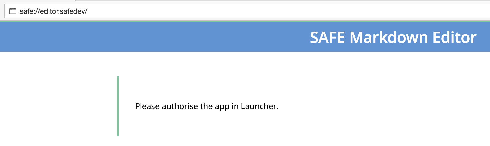
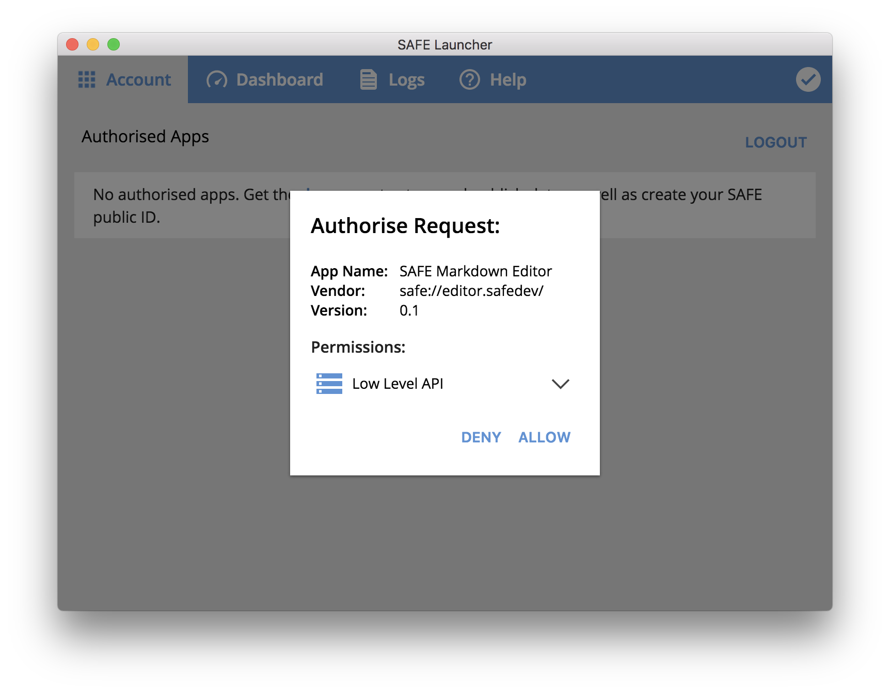

# Initialization

First, the app needs to receive an authorization token from SAFE Launcher. Then, it needs to obtain a cipher options handle and fetch a config file.

#### Contents

<!-- toc -->



## Authorize the app

The app sends an [authorization request](https://api.safedev.org/auth/) to SAFE Launcher.

#### [Authorize app](https://api.safedev.org/auth/authorize-app.html)

```
POST /auth
```

##### [store.js](https://github.com/maidsafe/safe_examples/blob/6f740f79ce30349c2b94252d6856927375bf3dbe/markdown_editor/src/store.js#L77-L84)

```js
safeAuth.authorise({
  'name': APP_NAME,
  'id': APP_ID,
  'version': APP_VERSION,
  'vendor': 'MaidSafe Ltd.',
  'permissions': ['LOW_LEVEL_API']
},
APP_ID)
```

For this example app, `APP_NAME`, `APP_ID` and `APP_VERSION` have been set to the following values:

##### [config.js](https://github.com/maidsafe/safe_examples/blob/6f740f79ce30349c2b94252d6856927375bf3dbe/markdown_editor/src/config.js#L10-L12)

```js
export const APP_NAME = "SAFE Markdown Editor";
export const APP_VERSION = '0.1';
export const APP_ID = 'net.maidsafe.examples.markdown-editor';
```

SAFE Launcher displays a prompt with basic information about the app along with the requested permission (`LOW_LEVEL_API`). You can authorize this request by clicking on "ALLOW".



After you authorize the request, the app receives an authorization token and stores it in a global variable.

##### [store.js](https://github.com/maidsafe/safe_examples/blob/6f740f79ce30349c2b94252d6856927375bf3dbe/markdown_editor/src/store.js#L92)

```js
ACCESS_TOKEN = token;
```

## Obtain a cipher options handle

The app fetches a cipher options handle for symmetric encryption. It will be used to encrypt your Markdown files. That way, only you will be able to read them.

#### [Get cipher options handle](https://api.safedev.org/low-level-api/cipher-options/get-cipher-options-handle.html)

```
GET /cipher-opts/:encType/:keyHandle?
```

##### [store.js](https://github.com/maidsafe/safe_examples/blob/6f740f79ce30349c2b94252d6856927375bf3dbe/markdown_editor/src/store.js#L31-L32)

```js
safeCipherOpts.getHandle(ACCESS_TOKEN,
  window.safeCipherOpts.getEncryptionTypes().SYMMETRIC)
```

The app stores the cipher options handle in a global variable.

##### [store.js](https://github.com/maidsafe/safe_examples/blob/6f740f79ce30349c2b94252d6856927375bf3dbe/markdown_editor/src/store.js#L34)

```
SYMETRIC_CYPHER_HANDLE = extractHandle(res);
```

## Fetch the config file

Each Markdown file you create will be stored inside a new [versioned structured data](https://api.safedev.org/low-level-api/structured-data/). The app needs a way to retrieve your files on the SAFE Network. If the app doesn't properly keep track of the data it creates using the [low-level API](https://api.safedev.org/low-level-api/), the user might be unable to retrieve and delete data stored by the app.

The solution is to generate a random "user prefix" and store it inside a config file located in the app's root directory. This random user prefix will be used to assign IDs to the files you create. The ID of each file will be based on your user prefix and the filename. That way, the app can reuse the same random user prefix instead of creating a new one for each file.

In order to keep track of the filenames, the app creates a file index that will be used to store the names of all your files. This file index will be stored inside an unversioned structured data with an ID based on your user prefix.

Therefore, the app is able to retrieve all your files simply by retrieving your user prefix, which will be stored inside a config file located in the app's root directory. Using your user prefix, the app can fetch your file index, which contains the names of all your files. Individual files can be fetched using your user prefix and the filename.

### Generate a user prefix

The app generates a random "user prefix" that will be used to assign IDs to the files you create.

##### [store.js](https://github.com/maidsafe/safe_examples/blob/6f740f79ce30349c2b94252d6856927375bf3dbe/markdown_editor/src/store.js#L21-L28)

```js
const _createRandomUserPrefix = () => {
  let randomString = '';
  for (var i = 0; i < 10; i++) {
    // and ten random ascii chars
    randomString += String.fromCharCode(Math.floor(Math.random(100) * 100));
  }
  return btoa(`${APP_ID}@${APP_VERSION}#${(new Date()).getTime()}-${randomString}`);
};
```

### Create a config file

The app tries to create a config file in its root directory. This config file is used to store your user prefix.

#### [Create file](https://api.safedev.org/nfs/file/create-file.html)

```
POST /nfs/file/:rootPath/:filePath
```

##### [store.js](https://github.com/maidsafe/safe_examples/blob/6f740f79ce30349c2b94252d6856927375bf3dbe/markdown_editor/src/store.js#L43-L46)

```js
safeNFS.createFile(ACCESS_TOKEN,
  FILE_NAME,
  JSON.stringify({ 'user_prefix': _createRandomUserPrefix() }), 'application/json')
```

For this example app, `FILE_NAME` has been set to `app_config.json`.

##### [store.js](https://github.com/maidsafe/safe_examples/blob/6f740f79ce30349c2b94252d6856927375bf3dbe/markdown_editor/src/store.js#L42)

```js
const FILE_NAME = 'app_config.json';
```

If a config file called `app_config.json` already exists in the app's root directory, SAFE Launcher will return an error and the app will simply use the existing config file instead.

### Read the config file

The app reads the content of the config file.

#### [Get file](https://api.safedev.org/nfs/file/get-file.html)

```
GET /nfs/file/:rootPath/:filePath
```

##### [store.js](https://github.com/maidsafe/safe_examples/blob/6f740f79ce30349c2b94252d6856927375bf3dbe/markdown_editor/src/store.js#L48)

```js
safeNFS.getFile(ACCESS_TOKEN, FILE_NAME)
```

The app then stores your user prefix – which was contained inside the config file – in a global variable.

##### [store.js](https://github.com/maidsafe/safe_examples/blob/6f740f79ce30349c2b94252d6856927375bf3dbe/markdown_editor/src/store.js#L50)

```js
USER_PREFIX = config.user_prefix
```

## Fetch the file index

Finally, the app needs to [fetch the file index](fetch-file-index.md) associated with your user prefix. Your file index contains the name of all your files.
