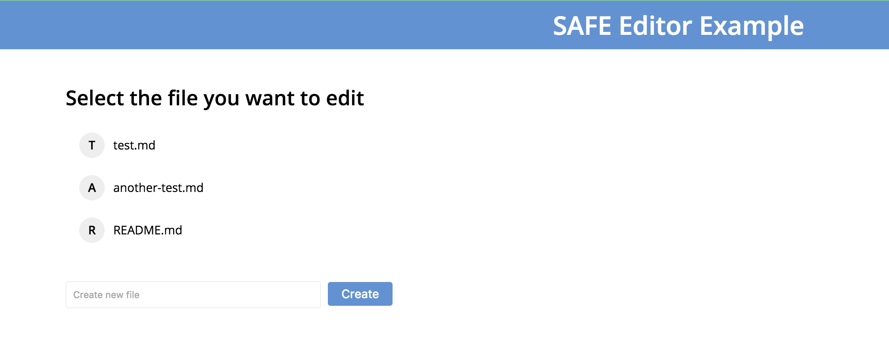

# Load file index

#### Contents

<!-- toc -->



##### [store.js](https://github.com/shankar2105/safe_examples_private/blob/ben_versioning_editor/versioning_editor/src/store.js#L145)

```js
safeDataId.getStructuredDataHandle(ACCESS_TOKEN, INDEX_FILE_NAME, 500)
```

##### [store.js](https://github.com/shankar2105/safe_examples_private/blob/ben_versioning_editor/versioning_editor/src/store.js#L147)

```js
safeStructuredData.getHandle(ACCESS_TOKEN, handle)
```

## try to read

##### [store.js](https://github.com/shankar2105/safe_examples_private/blob/ben_versioning_editor/versioning_editor/src/store.js#L155-L155)

```js
safeStructuredData.readData(ACCESS_TOKEN, sdHandle, '')
```

## doesn't exist

##### [store.js](https://github.com/shankar2105/safe_examples_private/blob/ben_versioning_editor/versioning_editor/src/store.js#L161-L162)

```js
safeStructuredData.create(ACCESS_TOKEN, INDEX_FILE_NAME, 500,
  new Buffer(JSON.stringify({})).toString('base64'), SYMETRIC_CYPHER_HANDLE)
```

##### [store.js](https://github.com/shankar2105/safe_examples_private/blob/ben_versioning_editor/versioning_editor/src/store.js#L165)

```js
safeStructuredData.put(ACCESS_TOKEN, INDEX_HANDLE)
```

```js
// store payload for future reference
FILE_INDEX = payload;
```
