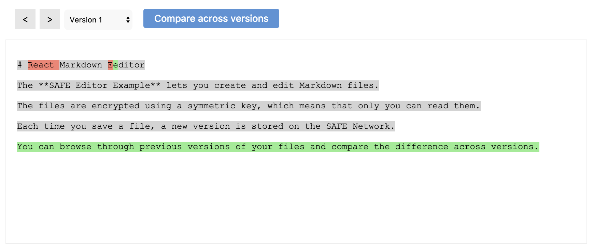

# Save a new version

When you edit an existing file, a new version is stored inside the structured data associated with that file.

#### Contents

<!-- toc -->



## Get a data ID handle

The app obtains a data ID handle for the versioned structured data (type tag 501) that contains the file you just edited. The ID of this structured data is based on your user prefix and the name of the file.

#### [Get data ID handle for structured data](https://api.safedev.org/low-level-api/data-id/get-data-id-handle.html#for-structured-data)

```
POST /data-id/structured-data
```

##### [store.js](https://github.com/maidsafe/safe_examples/blob/6f740f79ce30349c2b94252d6856927375bf3dbe/markdown_editor/src/store.js#L55)

```js
safeDataId.getStructuredDataHandle(ACCESS_TOKEN, btoa(`${USER_PREFIX}:${filename}`), 501)
```

## Get a structured data handle

The app obtains a structured data handle using the data ID handle of the file you just edited.

#### [Get structured data handle](https://api.safedev.org/low-level-api/structured-data/get-structured-data-handle.html)

```
GET /structured-data/handle/:dataIdHandle
```

##### [store.js](https://github.com/maidsafe/safe_examples/blob/6f740f79ce30349c2b94252d6856927375bf3dbe/markdown_editor/src/store.js#L58)

```js
safeStructuredData.getHandle(ACCESS_TOKEN, dataIdHandle)
```

After obtaining a structured data handle, the app drops the data ID handle of the file you just edited.

#### [Drop data ID handle](https://api.safedev.org/low-level-api/data-id/drop-data-id-handle.html)

```
DELETE /data-id/:handleId
```

##### [store.js](https://github.com/maidsafe/safe_examples/blob/6f740f79ce30349c2b94252d6856927375bf3dbe/markdown_editor/src/store.js#L61)

```js
safeDataId.dropHandle(ACCESS_TOKEN, dataIdHandle)
```

## Update the file

The app stores a new version inside the structured data associated with the file you just edited. It's encrypted using the cipher options handle previously obtained.

#### [Update structured data](https://api.safedev.org/low-level-api/structured-data/update-structured-data.html)

```
PATCH /structured-data/:handleId
```

##### [store.js](https://github.com/maidsafe/safe_examples/blob/6f740f79ce30349c2b94252d6856927375bf3dbe/markdown_editor/src/store.js#L70)

```js
safeStructuredData.updateData(ACCESS_TOKEN, handleId, payload, SYMETRIC_CYPHER_HANDLE)
```

This new version includes the Markdown content and the current time (encoded as a base 64 string).

##### [store.js](https://github.com/maidsafe/safe_examples/blob/6f740f79ce30349c2b94252d6856927375bf3dbe/markdown_editor/src/store.js#L111-L114)

```js
const payload = new Buffer(JSON.stringify({
  ts: (new Date()).getTime(),
  content: data
})).toString('base64');
```

The app saves the new version of your file by sending a POST request to the SAFE Network.

#### [Save structured data](https://api.safedev.org/low-level-api/structured-data/save-structured-data.html#post-endpoint)

```
POST /structured-data/:handleId
```

##### [store.js](https://github.com/maidsafe/safe_examples/blob/6f740f79ce30349c2b94252d6856927375bf3dbe/markdown_editor/src/store.js#L71)

```js
safeStructuredData.post(ACCESS_TOKEN, handleId)
```

## Fetch all versions

The app [refetches all the versions](fetch-all-version.dm) of the file and displays them in the UI.


