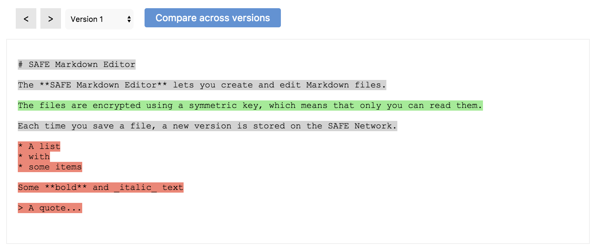

# Save a new version

#### Contents

<!-- toc -->



##### [store.js](https://github.com/shankar2105/safe_examples_private/blob/ben_versioning_editor/versioning_editor/src/store.js#L111-L114)

```js
const payload = new Buffer(JSON.stringify({
  ts: (new Date()).getTime(),
  content: data
})).toString('base64');
```

##### [store.js](https://github.com/shankar2105/safe_examples_private/blob/ben_versioning_editor/versioning_editor/src/store.js#L55)

```js
safeDataId.getStructuredDataHandle(ACCESS_TOKEN, btoa(`${USER_PREFIX}:${filename}`), 501)
```

##### [store.js](https://github.com/shankar2105/safe_examples_private/blob/ben_versioning_editor/versioning_editor/src/store.js#L58)

```js
safeStructuredData.getHandle(ACCESS_TOKEN, dataIdHandle)
```

##### [store.js](https://github.com/shankar2105/safe_examples_private/blob/ben_versioning_editor/versioning_editor/src/store.js#L61)

```js
safeDataId.dropHandle(ACCESS_TOKEN, dataIdHandle)
```

##### [store.js](https://github.com/shankar2105/safe_examples_private/blob/ben_versioning_editor/versioning_editor/src/store.js#L70)

```js
safeStructuredData.updateData(ACCESS_TOKEN, handleId, payload, SYMETRIC_CYPHER_HANDLE)
```

##### [store.js](https://github.com/shankar2105/safe_examples_private/blob/ben_versioning_editor/versioning_editor/src/store.js#L71)

```js
safeStructuredData.post(ACCESS_TOKEN, handleId)
```

## Load file index

Reload file index

## Load file versions

Load file versions
