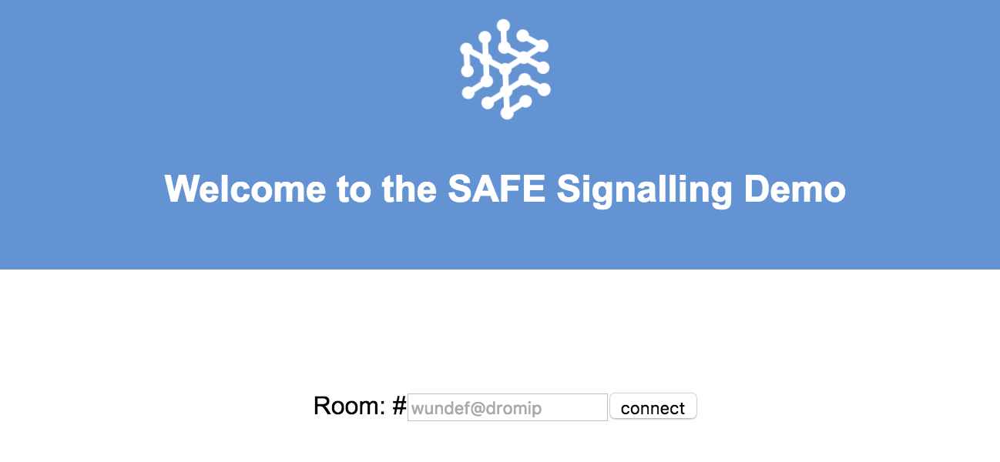
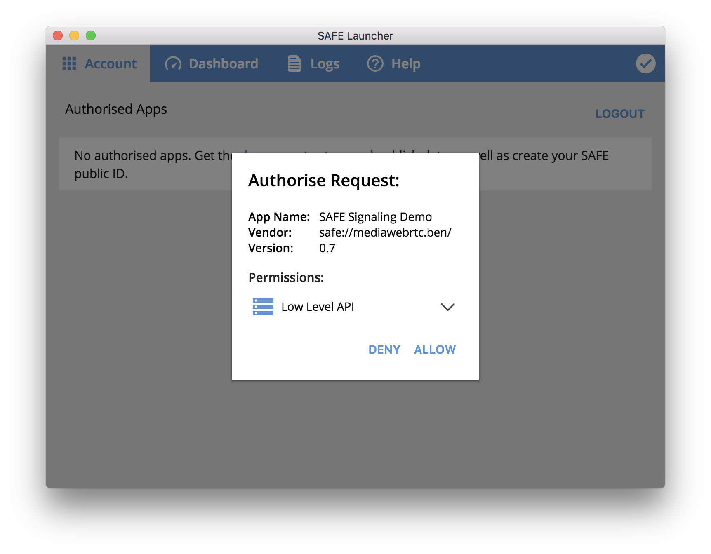
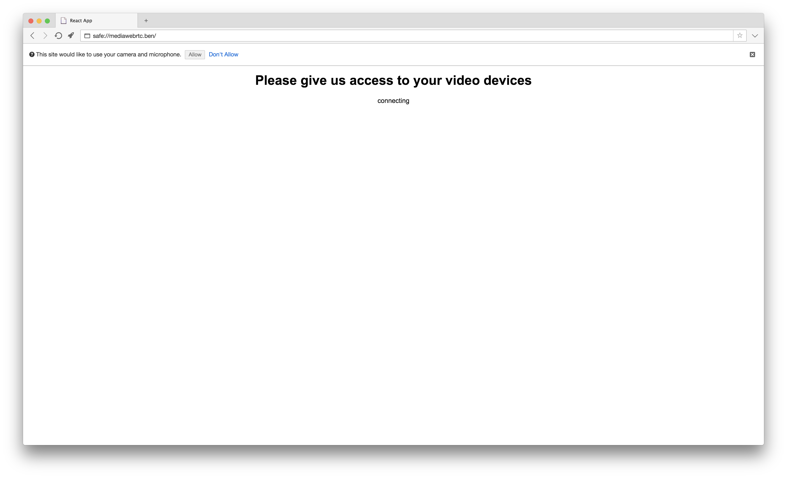
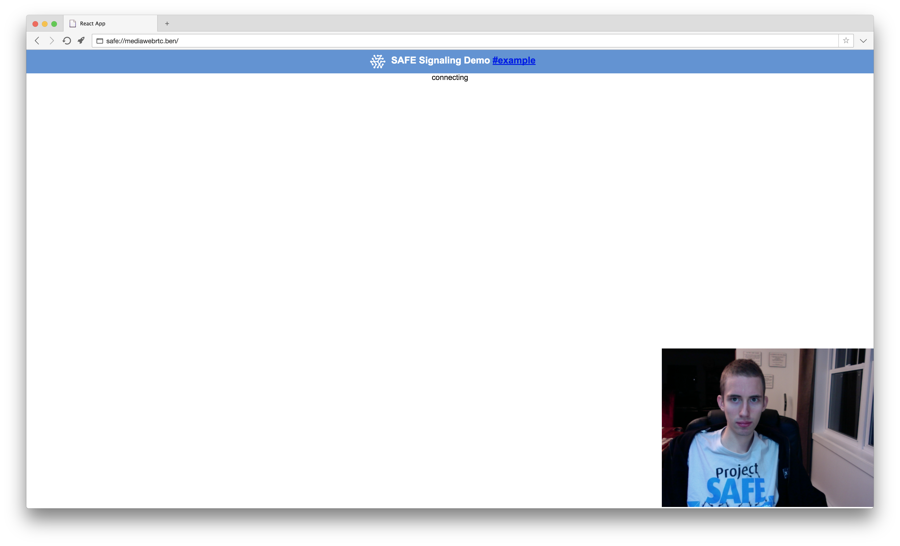

# Initialization

First, you need to select a room, authorize the app and give it access to your webcam.

#### Contents

<!-- toc -->



## Select a room

If you haven't selected a room yet, the app will prompt you to enter a room name. Alternatively, if you access a link that contains a [fragment identifier](https://en.wikipedia.org/wiki/Fragment_identifier) (e.g. `safe://mediawebrtc.ben#example`), the app will use it as the room name.

##### [App.js](https://github.com/maidsafe/safe_examples/blob/9f51976fbc5a3c0fa1e14b61df9701d1680dc1aa/webrtc_app/src/App.js#L21-L24)

```js
this.state = {
  'room': location.hash.length > 1 ? location.hash.slice(1) : null,
  'randomRoom': roomNameGenerator()
}
```

## Authorize the app

Once the app knows what room you want to connect to, it sends an [authorization request](https://api.safedev.org/auth/) to SAFE Launcher.

#### [Authorize app](https://api.safedev.org/auth/authorize-app.html)

```
POST /auth
```

##### [store.js](https://github.com/maidsafe/safe_examples/blob/9f51976fbc5a3c0fa1e14b61df9701d1680dc1aa/webrtc_app/src/store.js#L18-L24)

```js
safeAuth.authorise({
  'name': 'SAFE Signaling Demo',
  'id': APP_ID,
  'version': version,
  'vendor': 'MaidSafe Ltd.',
  'permissions': ['LOW_LEVEL_API']
},
  APP_ID)
```

For this example app, `APP_ID` has been set to `example.signaling.v1`.

##### [store.js](https://github.com/maidsafe/safe_examples/blob/9f51976fbc5a3c0fa1e14b61df9701d1680dc1aa/webrtc_app/src/store.js#L10)

```js
export const APP_ID = 'example.signaling.v1'
```

SAFE Launcher displays a prompt with basic information about the app along with the requested permission (`LOW_LEVEL_API`). You can authorize this request by clicking on "ALLOW".



After you authorize the request, the app receives an authorization token.

## Check if an offer is present

If you are the first user to join a room (the person initiating the call), the app [creates an offer](create-an-offer.md) and tries to store it inside a structured data with an ID based on the name of the room. This offer includes a session description in [SDP](https://en.wikipedia.org/wiki/Session_Description_Protocol) format, and it needs to be [delivered to the call recipient](receive-an-offer.md) (the person receiving the call).

If you are joining a room where another user is waiting for you, the app needs to [receive an offer](receive-an-offer.md) from the caller (the person initiating the call). The app expects this offer to be stored inside a structured data with an ID based on the name of the room. The call recipient then [responds with an answer message](create-an-answer.md), which also contains an SDP description.

##### [Room.js](https://github.com/maidsafe/safe_examples/blob/9f51976fbc5a3c0fa1e14b61df9701d1680dc1aa/webrtc_app/src/components/Room.js#L19-L25)

```js
readData(this.props.room)
  .then((payload) => {
    this.setState({'peerPayload': payload, 'authorised': true})
  }).catch((err) => {
    console.log(err)
    this.setState({'peerPayload': false, 'authorised': true})
  })
```

### If an offer is found

The app [creates an answer](create-an-answer.md) and stores it inside a structured data with an ID based on the random ID provided by the caller.

### If an offer is not found

The app [creates an offer](create-an-offer.md) and tries to store it inside a structured data with an ID based on the name of the room.

## Request access to video devices

The app also prompts you for permission to use one video and one audio input device using the [MediaDevices.getUserMedia()](https://developer.mozilla.org/en-US/docs/Web/API/MediaDevices/getUserMedia) method.

##### [VideoBlock.js](https://github.com/maidsafe/safe_examples/blob/9f51976fbc5a3c0fa1e14b61df9701d1680dc1aa/webrtc_app/src/components/VideoBlock.js#L15-L21)

```js
navigator.mediaDevices.getUserMedia({
  audio: true,
  video: {
    facingMode: 'user'
    // frameRate: { ideal: 10, max: 15 }
  }
})
```



After you click on "Allow", the app starts showing a video stream of your webcam.


