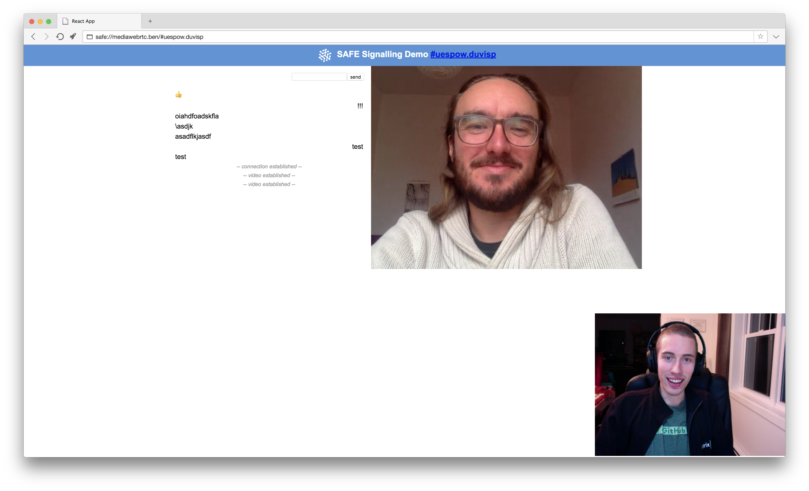

# Receive an answer

The app needs to receive an answer (a session description in [SDP](https://en.wikipedia.org/wiki/Session_Description_Protocol) format) from the call recipient (the person receiving the call). The app expects this answer to be stored inside a structured data with an ID based on the random ID provided by the caller.

#### Contents

<!-- toc -->

## Get data identifier handle

The app fetches a data identifier handle for the structured data that is expected to contain the answer.

#### [Get data ID handle for structured data](https://api.safedev.org/low-level-api/data-id/get-data-id-handle.html#for-structured-data)

```
POST /data-id/structured-data
```

##### [store.js](https://github.com/maidsafe/safe_examples/blob/9f51976fbc5a3c0fa1e14b61df9701d1680dc1aa/webrtc_app/src/store.js#L45)

```js
safeDataId.getStructuredDataHandle(ACCESS_TOKEN, address, 500)
```

The address of the structured data is based on the app ID (`example.signaling.v1`) and the random ID provided by the caller. The structured data is unversioned (type 500).

##### [store.js](https://github.com/maidsafe/safe_examples/blob/9f51976fbc5a3c0fa1e14b61df9701d1680dc1aa/webrtc_app/src/store.js#L42)

```js
const address = btoa(`${APP_ID}-${item}`)
```

## Get structured data handle

The app tries to fetch a structured data handle using the data identifier handle of the answer.

#### [Get structured data handle](https://api.safedev.org/low-level-api/structured-data/get-structured-data-handle.html)

```
GET /structured-data/handle/:dataIdHandle
```

##### [store.js](https://github.com/maidsafe/safe_examples/blob/9f51976fbc5a3c0fa1e14b61df9701d1680dc1aa/webrtc_app/src/store.js#L50)

```js
safeStructuredData.getHandle(ACCESS_TOKEN, dataHandleId)
```

If the structured data doesn't exist, the app waits 2 seconds and tries again. The app keeps making GET requests to the SAFE Network until it finds a structured data with an ID based on the random ID provided by the caller.

##### [PeerView.js](https://github.com/maidsafe/safe_examples/blob/9f51976fbc5a3c0fa1e14b61df9701d1680dc1aa/webrtc_app/src/components/PeerView.js#L82-L89)

```js
if (initiator) {
  let poller = window.setInterval(() => {
    readData(myNewId).then((data) => {
      window.clearInterval(poller)
      peer.signal(data.payload)
    })
  }, 2000) // we poll once every 2 seconds
}
```

## Drop data identifier handle

The app drops the data identifier handle of the answer.

#### [Drop handle](https://github.com/maidsafe/rfcs/blob/master/text/0042-launcher-api-v0.6/api/data_identifier.md#drop-handle)

```
DELETE /data-id/:handleId
```

##### [store.js](https://github.com/maidsafe/safe_examples/blob/9f51976fbc5a3c0fa1e14b61df9701d1680dc1aa/webrtc_app/src/store.js#L56)

```js
safeDataId.dropHandle(ACCESS_TOKEN, dataHandleId)
```

## Fetch the structured data

The app fetches the content of the structured data using the structured data handle.

#### [Read structured data](https://api.safedev.org/low-level-api/structured-data/read-structured-data.html)

```
GET /structured-data/:handleId/:version?
```

##### [store.js](https://github.com/maidsafe/safe_examples/blob/9f51976fbc5a3c0fa1e14b61df9701d1680dc1aa/webrtc_app/src/store.js#L57)

```js
safeStructuredData.readData(ACCESS_TOKEN, handleId)
```

## Drop the structured data handle

The app drops the structured data handle of the answer.

#### [Drop handle](https://github.com/maidsafe/rfcs/blob/master/text/0042-launcher-api-v0.6/api/structured_data.md#drop-handle)

```
DELETE /structured-data/handle/:handleId
```

##### [store.js](https://github.com/maidsafe/safe_examples/blob/9f51976fbc5a3c0fa1e14b61df9701d1680dc1aa/webrtc_app/src/store.js#L61)

```js
safeStructuredData.dropHandle(ACCESS_TOKEN, handleId)
```

---

The WebRTC connection is then established!


