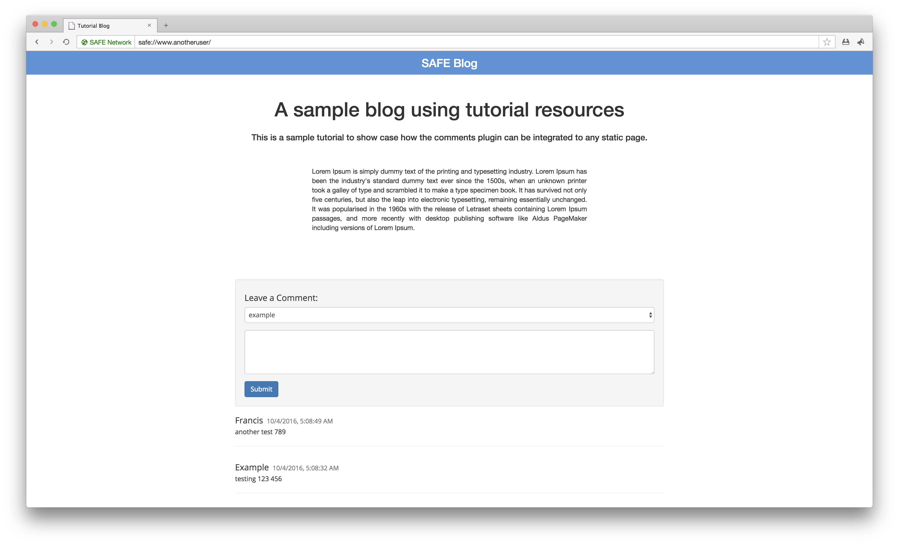

# Website with comments

In this tutorial, you will learn how to **enable comments on your SAFE website**!

We built two comments plugin: one for **permanent comments** and the other for **editable comments**.

Both plugins let people comment on content using their [public name](https://api.safedev.org/dns/). They also enable the website owner to delete comments and block users.

#### Contents

<!-- toc -->



## Overview

This tutorial will showcase how to:

- [Fetch public names](fetch-public-names.md)
- [Fetch comments](fetch-comments.md)
- [Enable comments](enable-comments.md)
- [Add a comment](add-a-comment.md)
- [Edit a comment](edit-a-comment.md)
- [Fetch comment history](fetch-comment-history.md)
- [Delete a comment](delete-a-comment.md)
- [Block a user](block-a-user.md)
- [Unblock a user](unblock-a-user.md)

### SAFE APIs

You will learn about the following APIs:

- [Authorization](https://api.safedev.org/auth/)
- [DNS](https://api.safedev.org/dns/)
- [Appendable Data](https://api.safedev.org/low-level-api/appendable-data/)
- [Data ID](https://api.safedev.org/low-level-api/data-id/)
- [Immutable Data](https://api.safedev.org/low-level-api/immutable-data/) (for permanent comments)
- [Structured Data](https://api.safedev.org/low-level-api/structured-data/) (for editable comments)
- [Cipher Options](https://api.safedev.org/low-level-api/cipher-options/)

#### External libraries

- [Bootstrap](https://getbootstrap.com/)
- [jQuery](https://jquery.com/)

## Source code

Browse the source code on GitHub:

- [Permanent Comments Plugin](https://github.com/maidsafe/safe_examples/tree/master/permanent_comments_plugin)
- [Editable Comments Plugin](https://github.com/maidsafe/safe_examples/tree/master/editable_comments_plugin)

### Usage instructions

#### Requirements

##### 1. SAFE Launcher

Start [SAFE Launcher v0.10.0](https://github.com/maidsafe/safe_launcher/releases/tag/0.10.0) and log in.

##### 2. SAFE Browser

Start [SAFE Browser v0.4.0](https://github.com/joshuef/beaker/releases/tag/v0.4.0).

##### 3. SAFE Demo App

Start [SAFE Demo App v0.6.2](https://github.com/maidsafe/safe_examples/releases/tag/0.10.1).

#### Setup

##### 1. Clone [this GitHub repository](https://github.com/maidsafe/safe_examples)

```
git clone https://github.com/maidsafe/safe_examples.git
```

If you don't have Git installed, you can download it from [git-scm.com](https://git-scm.com/downloads).

##### 2. Add this folder to your website

Permanent comments:

```
cd safe_examples/permanent_comments_plugin/comments
```

Editable comments:

```
cd safe_examples/editable_comments_plugin/comments
```

##### 2. Add this code snippet to your SAFE website

```html
<script>
window.__COMMENTS_ID = "#comments"
</script>
<script type="application/javascript" id="comments-loader" src="./comments/main.js"/>
```

If you specify the `__COMMENTS_ID` as shown above, the library will automatically initialize at startup and add the comments UI to the specified element. Omitting that reference, comments won't be loaded automatically but need to be invoked directly via:

```html
<script>
  window.safeComments.init('#myCommentsId');
</script>
```

##### 3. Upload your website using SAFE Demo App

Upload your website folder to the **Public folder** of SAFE Demo App and map that folder to a service and a public name (e.g. `blog.example`).

##### 4. Open your website using SAFE Browser

Go to the URL of your website (e.g. `safe://blog.sample`). Select a page where you added the comments plugin and enable the option to allow comments for that page by clicking on the `Enable Comments` button. This button is only visible for the website owner. Once enabled, logged-in users who visit the page should be able to comment. The website owner can delete comments and block users.

### Example

```html
<!DOCTYPE html>
<html lang="en">
<head>
    <meta charset="UTF-8">
    <title>Tutorial Blog</title>
    <!-- Comment plugin resources -->
    <link type="text/css" rel="stylesheet" href="./style.css"/>
</head>
<body>
    <header>SAFE Blog</header>
    <div class="container">
        <div class="post">
            <h1 class="title text-center">
                A sample blog using tutorial resources
            </h1>
            <div class="desc text-center">
                This is a sample tutorial to show case how the comments plugin can be
                integrated to any static page.
            </div>
            <p class="context">
                Lorem Ipsum is simply dummy text of the printing and typesetting industry. Lorem Ipsum
                has been the industry's standard dummy text ever since the 1500s, when an unknown printer
                took a galley of type and scrambled it to make a type specimen book. It has survived not
                only five centuries, but also the leap into electronic typesetting, remaining essentially
                unchanged. It was popularised in the 1960s with the release of Letraset sheets containing
                Lorem Ipsum passages, and more recently with desktop publishing software like Aldus PageMaker
                including versions of Lorem Ipsum.
            </p>
        </div>
        <div id="comments"></div>
    </div>
    <script>
    window.__COMMENTS_ID = "#comments"
    </script>
    <script type="application/javascript" id="comments-loader" src="./comments/main.js"></script>
</body>
</html>
```

### Limitations

- `AppendableData` has a size limitation of 100 KiB. New comments can't be added if the appendable data has reached its maximum size.

<!-- are there other limitations? -->
