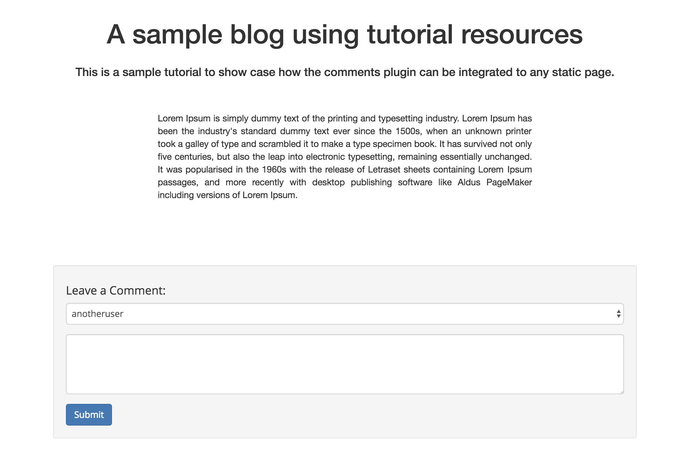

# Add a comment

You can add a comment to a webpage by creating a structured data and appending its data identifier to the appendable data associated with that webpage.

#### Contents

<!-- toc -->



## Create a structured data

The plugin creates a structured data representing your comment. The reason we are choosing to store comments using structured data is because the APIs for immutable data haven't been exposed in the SAFE Browser yet (we'll update the comments plugin to use immutable data once the necessary APIs have been added). To prevent users from editing their comments, it would be preferable to store comments using immutable data.

#### [POST /structured-data](https://github.com/maidsafe/rfcs/blob/master/text/0042-launcher-api-v0.6/api/structured_data.md#create)

```js
const createStructureData = () => {
  this.log('Create structured data');
  window.safeStructuredData.create(this.authToken, name, 501, payload)
    .then((res) => {
      currentSDHandleId = res.__parsedResponseBody__.handleId;
      put();
    }, (err) => {
      // handle error
      console.error(err);
      this.errorHandler(err);
    });
};
```

#### Parameters

1. The name parameter will be the public name you selected combined with the current timestamp and a random string.

2. The type tag will be 501 (unversioned) because the comments plugin always shows the latest version of each comment.

3. The payload parameter will contain the public name you selected, your comment and the current timestamp in JSON format (stored as a base64 string).

```js
let content = $(this.COMMENT_TEXT_ELEMENT_ID).val();
let publicName = this.getSelectedDns();
let timeStamp = (new Date()).getTime();
let name = publicName + timeStamp + this.generateRandomString();
let payload = {
  name: publicName,
  comment: content,
  time: timeStamp
};
payload = new Buffer(JSON.stringify(payload)).toString('base64');
```

#### Example

```json
{
  "name": "example",
  "comment": "test 123",
  "time": 1475234797311
}
```

The actual ID of the structured data will be the hash of the name parameter. The API will return a structured data handle representing your comment.

## Save the structured data

The plugins saves the structured data representing your comment to the SAFE Network.

```js
const put = () => {
  this.log('Put structured data');
  this.putStructureData(currentSDHandleId)
    .then((res) => {
      getSDDataHandleId();
    }, (err) => {
      console.error(err);
      this.errorHandler(err);
    });
};
```

#### [PUT /structured-data/:handleId](https://github.com/maidsafe/rfcs/blob/master/text/0042-launcher-api-v0.6/api/structured_data.md#save-structured-data)

```js
putStructureData(handleId) {
  return window.safeStructuredData.put(this.authToken, handleId);
}
```

## Get the data identifier handle

The plugin fetches the data identifier handle for the structured data representing your comment.

#### [GET /structured-data/data-id/:handleId](https://github.com/maidsafe/rfcs/blob/master/text/0042-launcher-api-v0.6/api/structured_data.md#get-dataidentifier-handle-for-structured-data)

```js
const getSDDataHandleId = () => {
  this.log('Get structured data handle id');
  window.safeStructuredData.getDataIdHandle(this.authToken, currentSDHandleId)
    .then((res) => {
      appendToAppendableData(res.__parsedResponseBody__.handleId);
    }, (err) => {
      console.error(err);
      this.errorHandler(err);
    });
};
```

## Append the data identifier to the appendable data

The plugin appends the data identifier representing your comment to the appendable data of the current page and [reload the comments](load-comments.md).

#### [PUT /appendable-data/:handleId/:dataIdHandle](https://github.com/maidsafe/rfcs/blob/master/text/0042-launcher-api-v0.6/api/appendable_data.md#append-data)

```js
const appendToAppendableData = (dataHandleId) => {
  this.log('Append structured data handle id');
  window.safeAppendableData.append(this.authToken, this.currentPostHandleId, dataHandleId)
    .then((res) => {
      this.dropDataIdHandle();
      this.dropStructuredDataHandle(currentSDHandleId);
      this.resetCommentForm();
      this.toggleSpinner();
      this.fetchComments();
    }, (err) => {
      // handle error
      console.error(err);
      window.alert('Could not post a comment');
      this.errorHandler(err);
    });
};
```

### Drop the data identifier handle

The plugin drops the data identifier representing your comment.

#### [DELETE /data-id/:handleId](https://github.com/maidsafe/rfcs/blob/master/text/0042-launcher-api-v0.6/api/data_identifier.md#drop-handle)

```js
dropDataIdHandle(dataIdHandle) {
  window.safeDataId.dropHandle(this.authToken, dataIdHandle);
}
```

### Drop the structured data handle

The plugin drops the structured data handle representing your comment.

#### [DELETE /structured-data/handle/:handleId](https://github.com/maidsafe/rfcs/blob/master/text/0042-launcher-api-v0.6/api/structured_data.md#drop-handle)

```js
dropStructuredDataHandle(handleId) {
  window.safeStructuredData.dropHandle(this.authToken, handleId);
}
```
