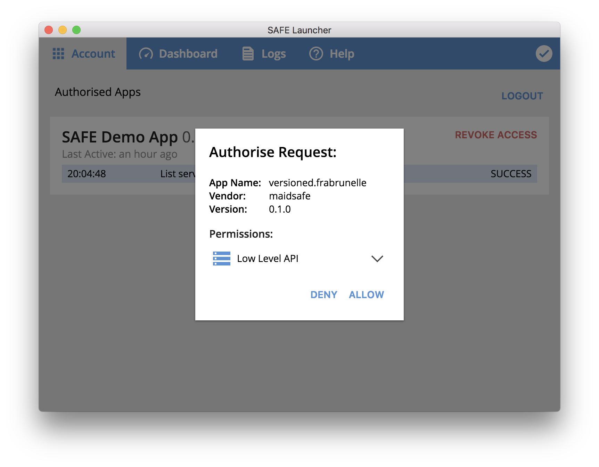

# Authorization

If you are the website owner and you want to enable comments, you need to authorize the comments plugin using SAFE Launcher. If you want to add a comment to a SAFE website, you also need to authorize the comments plugin.

#### Contents

<!-- toc -->

## Check for an authorization token

First, the plugin checks if an authorization token is stored in the memory of the SAFE Browser.

##### [controller.js](https://github.com/maidsafe/safe_examples/blob/19cb638c3f02a4b9b9492e44f1527f6010c8e9ba/permanent_comments_plugin/comments/src/controller.js#L64)

```js
window.safeAuth.getAuthToken(this._LOCAL_STORAGE_TOKEN_KEY)
```

A different `_LOCAL_STORAGE_TOKEN_KEY` is used for each website (in order to avoid collisions).

##### [controller.js](https://github.com/maidsafe/safe_examples/blob/19cb638c3f02a4b9b9492e44f1527f6010c8e9ba/permanent_comments_plugin/comments/src/controller.js#L24-L25)

```js
this._hostName = window.location.host.replace(/.safenet$/g, '')
this._LOCAL_STORAGE_TOKEN_KEY = `SAFE_TOKEN_${this._hostName}`
```

#### Example

The value of `_LOCAL_STORAGE_TOKEN_KEY` for `safe://blog.example` would be `SAFE_TOKEN_blog.example`.

## If an authorization token is found

The plugin retrieves the authorization token from the memory of the SAFE Browser. For example, this can happen if you refresh a website that you had already authorized.

## If an authorization token is not found

The plugin tries to obtain an authorization token from SAFE Launcher. If you are not logged in, the plugin simply [fetches the comments](fetch-comments.md) associated with the current page.

### Authorize the plugin

The plugin sends an [authorization request](https://api.safedev.org/auth/) to SAFE Launcher.

#### [Authorize app](https://api.safedev.org/auth/authorize-app.html)

```
POST /auth
```

##### [controller.js](https://github.com/maidsafe/safe_examples/blob/19cb638c3f02a4b9b9492e44f1527f6010c8e9ba/permanent_comments_plugin/comments/src/controller.js#L485)

```js
window.safeAuth.authorise(this._data.appInfo, this._LOCAL_STORAGE_TOKEN_KEY)
```

`this._data.appInfo` represents this object:

##### [model.js](https://github.com/maidsafe/safe_examples/blob/19cb638c3f02a4b9b9492e44f1527f6010c8e9ba/permanent_comments_plugin/comments/src/model.js#L12-L20)

```js
{
  name: window.location.host,
  id: 'tutorial.maidsafe.net',
  version: '0.1.0',
  vendor: 'maidsafe',
  permissions: [
    'LOW_LEVEL_API'
  ]
}
```

#### Example

The authorization payload for `blog.example` would look like this:

```json
{
  "app": {
    "name": "blog.example",
    "id": "tutorial.maidsafe.net",
    "version": "0.0.1",
    "vendor": "maidsafe"
  },
  "permissions": ["LOW_LEVEL_API"]
}
```



After you authorize the request, the plugin receives an authorization token and stores it in the memory of the SAFE Browser.

##### [controller.js](https://github.com/maidsafe/safe_examples/blob/19cb638c3f02a4b9b9492e44f1527f6010c8e9ba/permanent_comments_plugin/comments/src/controller.js#L499)

```js
window.safeAuth.setAuthToken(this._LOCAL_STORAGE_TOKEN_KEY, token)
```

That way, you won't have to reauthorize the plugin if you refresh the current page or access another page from the same website, because the plugin will be able to retrieve that authorization token from the memory of the SAFE Browser.

## Fetch public names

After obtaining an authorization token, the plugin will [fetch your public names](fetch-public-names.md) and add them to the UI.


