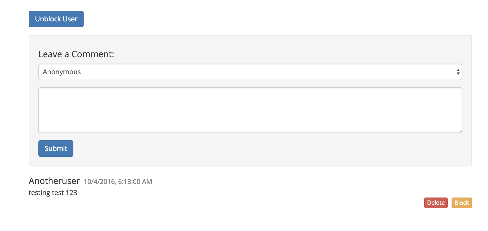

# Block a user

If you are the website owner, you can block users by adding their signing key to the appendable data associated with the current page.

#### Contents

<!-- toc -->



## Get the signing key of a user

The plugin fetches the signing key of the user you want to block.

#### [GET /appendable-data/sign-key/:handleId/:index](https://github.com/maidsafe/rfcs/blob/master/text/0042-launcher-api-v0.6/api/appendable_data.md#get-signing-key-of-a-data-by-index)

```js
this.log('Get signed key at :: ' + index);
window.safeAppendableData.getSignKeyAt(this.authToken, this.currentPostHandleId, index)
  .then((res) => {
    signKeyHandleId = res.__parsedResponseBody__.handleId;
    addFilter();
  }, (err) => {
    console.error(err);
    this.errorHandler(err);
  });
```

## Add the signing key to the filter

The plugin adds the signing key of the user you want to block to the filter of the appendable data associated with the current page. Since the filter of the appendable data is a blacklist, everyone except the keys listed in the filter will be allowed to append data.

#### [PUT /appendable-data/filter/:handleId](https://github.com/maidsafe/rfcs/blob/master/text/0042-launcher-api-v0.6/api/appendable_data.md#add-sign-keys-to-filter)

```js
const addFilter = () => {
  this.log('Add filter');
  window.safeAppendableData.addToFilter(this.authToken, this.currentPostHandleId, [signKeyHandleId])
    .then((res) => {
      console.log(res);
      post();
    }, (err) => {
      console.error(err);
      this.errorHandler(err);
    });
};
```

## Update the appendable data

The plugin updates the appendable data associated with the current page by sending a POST request to the SAFE Network.

#### [POST /appendable-data/:handleId](https://github.com/maidsafe/rfcs/blob/master/text/0042-launcher-api-v0.6/api/appendable_data.md#save-appendabledata)

```js
postAppendableData(handleId) {
  return window.safeAppendableData.post(this.authToken, handleId);
}
```

```js
const post = () => {
  this.log('Post appendable data');
  this.postAppendableData(this.currentPostHandleId)
    .then((res) => {
      console.log(res);
      this.saveBlockedUser(userName, signKeyHandleId);
      this.fetchComments();
    }, (err) => {
      console.error(err);
      this.errorHandler(err);
    });
};
```

Whenever you block a user, the plugin adds their public name and their signing key to a structured data associated with the current page. Using this list of blocked users, you can [unblock a user](unblock-a-user.md) based on their public name.

## If the structured data for blocked users is found

The plugin updates the structured data with the public name and the serialized signing key of the user you want to block.

### Serialize the signing key

The plugins serializes the signing key of the user you want to block.

#### GET /sign-key/serialise/:handleId

```js
window.safeSignKey.serialise(this.authToken, signKeyHandle)
```

The API returns the handle ID for the serialized signing key.

### Update the structured data for blocked users

The plugin adds the user you just blocked to the list of block users for the current page.

#### [PATCH /structured-data/:handleId](https://github.com/maidsafe/rfcs/blob/master/text/0042-launcher-api-v0.6/api/structured_data.md#update-data)

```js
const serialisedSignKey = new Buffer(res).toString('base64');
this.blockedUsers[userName] = serialisedSignKey;
window.safeStructuredData.updateData(this.authToken, this.blockedUserStructureDataHandle,
  new Buffer(JSON.stringify(this.blockedUsers)), this.symmetricCipherOptsHandle)
```

The plugin updates the structured data that contains the list of blocked users for the current page by sending a POST request to the SAFE Network.

#### [POST /structured-data/:handleId](https://github.com/maidsafe/rfcs/blob/master/text/0042-launcher-api-v0.6/api/structured_data.md#save-structured-data)

```js
window.safeStructuredData.post(this.authToken, this.blockedUserStructureDataHandle)
```

### Drop the handle for the signing key

The plugin drops the handle that represents the signing key of the user you just blocked.

#### DELETE /sign-key/:handleId

```js
window.safeSignKey.dropHandle(this.authToken, signKeyHandle);
this.toggleSpinner(false);
alert('User has been blocked');
```

After the user has been blocked, the plugin [reloads the comments](load-comments.md).

## If the structured data for blocked users is not found

The plugin creates a new structured data based on the URL of the current page. This structured data will be used to store the list of blocked users for the current page. Whenever you want to block a user, the plugin will add their public name and their signing key to that structured data.

### Serialize the signing key

The plugins serializes the signing key of the user you want to block.

#### GET /sign-key/serialise/:handleId

```js
window.safeSignKey.serialise(this.authToken, signKeyHandle)
```

The API returns the handle ID for the serialized signing key.

### Create a structured data for blocked users

The plugin creates a new structured data that contains the public name and the serialized signing key of the user you want to block.

#### [POST /structured-data](https://github.com/maidsafe/rfcs/blob/master/text/0042-launcher-api-v0.6/api/structured_data.md#create)

```js
const serialisedSignKey = new Buffer(res).toString('base64');
this.blockedUsers = {};
this.blockedUsers[userName] = serialisedSignKey;
const data = new Buffer(JSON.stringify(this.blockedUsers)).toString('base64');
window.safeStructuredData.create(this.authToken, this.getLocation() + '_blocked_users', 501,
  data, this.symmetricCipherOptsHandle)
```

### Save the structured data for blocked users

The plugin saves this new structured data by sending a PUT request to the SAFE Network.

#### [PUT /structured-data/:handleId](https://github.com/maidsafe/rfcs/blob/master/text/0042-launcher-api-v0.6/api/structured_data.md#save-structured-data)

```js
this.blockedUserStructureDataHandle = res.__parsedResponseBody__.handleId;
window.safeStructuredData.put(this.authToken, this.blockedUserStructureDataHandle)
```

### Drop the handle for the signing key

The plugin drops the handle that represents the signing key of the user you just blocked.

#### DELETE /sign-key/:handleId

```js
this.toggleSpinner(false);
window.safeSignKey.dropHandle(this.authToken, signKeyHandle);
alert('User has been blocked');
```

After the user has been blocked, the plugin [reloads the comments](load-comments.md).
