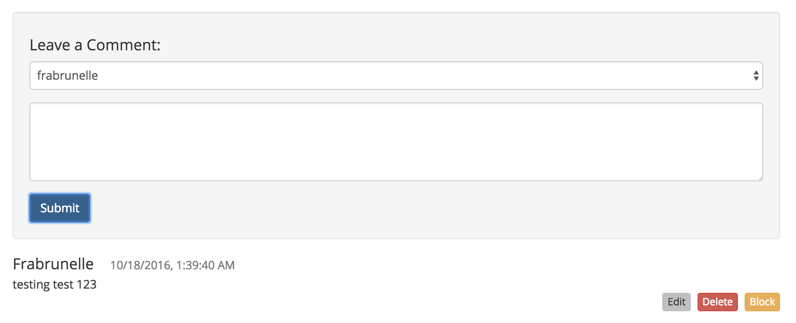
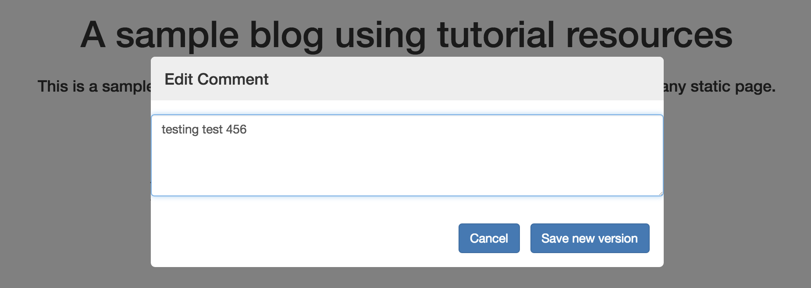

# Edit a comment

You can only edit your comments if the current page is using the [Editable Comments Plugin](https://github.com/maidsafe/safe_examples/tree/master/editable_comments_plugin).

Since comments are saved using versioned structured data (type 501), everyone will be able to see old comments by [browsing the comment history](fetch-comment-history.md).

#### Contents

<!-- toc -->





## Get the comment from the appendable data

The plugin fetches a data identifier handle for the comment you want to edit.

#### [Get data ID handle at index](https://api.safedev.org/low-level-api/appendable-data/get-data-id-handle-at-index.html#for-a-data-item)

```
GET /appendable-data/:handleId/:index
```

##### [controller.js](https://github.com/maidsafe/safe_examples/blob/19cb638c3f02a4b9b9492e44f1527f6010c8e9ba/editable_comments_plugin/comments/src/controller.js#L288-L289)

```js
window.safeAppendableData.getDataIdAt(
    this._authToken, this._currentPostHandleId, index)
```

## Get a structured data handle

The plugin fetches a structured data handle using the data identifier handle previously obtained.

#### [Get structured data handle](https://api.safedev.org/low-level-api/structured-data/get-structured-data-handle.html)

```
GET /structured-data/handle/:dataIdHandle
```

##### [controller.js](https://github.com/maidsafe/safe_examples/blob/19cb638c3f02a4b9b9492e44f1527f6010c8e9ba/editable_comments_plugin/comments/src/controller.js#L293)

```js
window.safeStructuredData.getHandle(this._authToken, address)
```

## Update the structured data

The plugin updates the structured data handle with the new version of the comment.

##### [controller.js](https://github.com/maidsafe/safe_examples/blob/19cb638c3f02a4b9b9492e44f1527f6010c8e9ba/editable_comments_plugin/comments/src/controller.js#L279-L284)

```js
const payload = new Buffer(JSON.stringify({
  name: original.name,
  comment: newText,
  time: original.time,  // we keep the original time so the order stays intact
  editedTime: (new Date()).getTime()
})).toString('base64')
```

#### [Update structured data](https://api.safedev.org/low-level-api/structured-data/update-structured-data.html)

```
PATCH /structured-data/:handleId
```

##### [controller.js](https://github.com/maidsafe/safe_examples/blob/19cb638c3f02a4b9b9492e44f1527f6010c8e9ba/editable_comments_plugin/comments/src/controller.js#L295)

```js
window.safeStructuredData.updateData(this._authToken, handleId, payload)
```

## Save the structured data

The plugin saves the new version of the comment by sending a POST request to the SAFE Network.

#### [Save structured data](https://api.safedev.org/low-level-api/structured-data/save-structured-data.html#post-endpoint)

```
POST /structured-data/:handleId
```

##### [controller.js](https://github.com/maidsafe/safe_examples/blob/19cb638c3f02a4b9b9492e44f1527f6010c8e9ba/editable_comments_plugin/comments/src/controller.js#L296)

```js
window.safeStructuredData.post(this._authToken, handleId)
```

## Drop the structured data handle

The plugin drops the structured data handle of the comment.

#### [Drop structured data handle](https://api.safedev.org/low-level-api/structured-data/drop-structured-data-handle.html)

```
DELETE /structured-data/handle/:handleId
```

##### [controller.js](https://github.com/maidsafe/safe_examples/blob/19cb638c3f02a4b9b9492e44f1527f6010c8e9ba/editable_comments_plugin/comments/src/controller.js#L298)

```js
window.safeStructuredData.dropHandle(this._authToken, dataIdHandle)
```

## Drop the data identifier handle

The plugin drops the data identifier handle of the comment.

#### [Drop data ID handle](https://api.safedev.org/low-level-api/data-id/drop-data-id-handle.html)

```
DELETE /data-id/:handleId
```

##### [controller.js](https://github.com/maidsafe/safe_examples/blob/19cb638c3f02a4b9b9492e44f1527f6010c8e9ba/editable_comments_plugin/comments/src/controller.js#L300)

```js
window.safeDataId.dropHandle(this._authToken, dataIdHandle)
```
