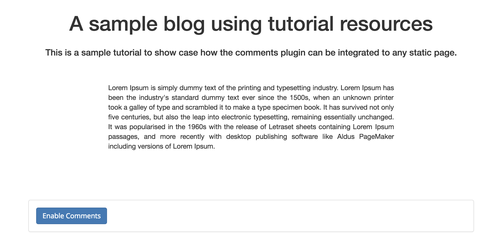

# Enable comments

You can enable comments for the current page by clicking on the `Enable Comments` button (only the website owner can see this button). This ensures that the website owner becomes the owner of the `AppendableData` used to hold the comments.

#### Contents

<!-- toc -->



## Create an appendable data

When you click on the `Enable Comments` button, the plugin creates an appendable data for the current page. By default, the filter of the appendable data will be a blacklist (as opposed to a whitelist). Everyone except the keys listed in the filter will be allowed to append data.

#### [Create AppendableData](https://github.com/maidsafe/rfcs/blob/master/text/0042-launcher-api-v0.6/api/appendable_data.md#create)

```
POST /appendable-data
```

##### [controller.js](https://github.com/maidsafe/safe_examples/blob/19cb638c3f02a4b9b9492e44f1527f6010c8e9ba/permanent_comments_plugin/comments/src/controller.js#L108)

```js
window.safeAppendableData.create(this._authToken, this._getLocation(), false)
```

The name of the appendable data is based on the URL of the current page.

##### [controller.js](https://github.com/maidsafe/safe_examples/blob/19cb638c3f02a4b9b9492e44f1527f6010c8e9ba/permanent_comments_plugin/comments/src/controller.js#L311-L316)

```js
_getLocation () {
  if (this._isDevMode() && this._data.user.dns) {
    return `comments-dev-${this._data.user.dns}/${window.location.pathname}`
  }
  return `${this._hostName}/${window.location.pathname}`
}
```

#### Example

```
blog.testing//post.html
```

The actual name of the appendable data is the hash of `_getLocation()`.

## Save the appendable data

The plugin saves the appendable data to the SAFE Network.

#### [Save AppendableData](https://github.com/maidsafe/rfcs/blob/master/text/0042-launcher-api-v0.6/api/appendable_data.md#save-appendabledata)

```
PUT /appendable-data/:handleId
```

##### [controller.js](https://github.com/maidsafe/safe_examples/blob/19cb638c3f02a4b9b9492e44f1527f6010c8e9ba/permanent_comments_plugin/comments/src/controller.js#L113)

```js
window.safeAppendableData.put(this._authToken, handleId)
```

After the appendable data has been successfully saved, the plugin refreshes the UI.


