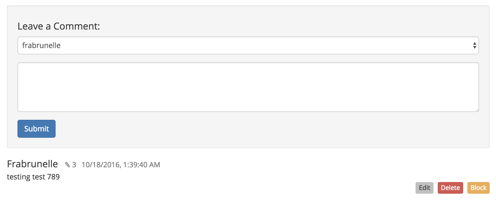
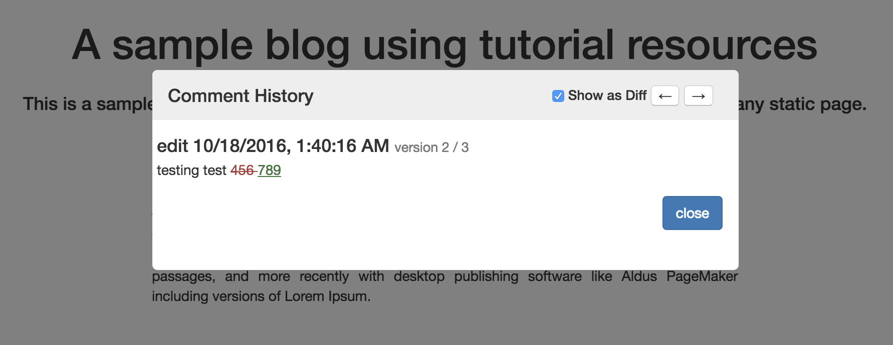

# Fetch comment history

You can see the history of each comment if the current page is using the [Editable Comments Plugin](https://github.com/maidsafe/safe_examples/tree/master/editable_comments_plugin).

When you click on the pencil icon for a given comment, the plugin will fetch all the previous versions of that comment and display them in a modal window.

#### Contents

<!-- toc -->





## Get the comment from the appendable data

The plugin fetches a data identifier handle for the comment you want to browse.

#### [Get data ID handle at index](https://api.safedev.org/low-level-api/appendable-data/get-data-id-handle-at-index.html#for-a-data-item)

```
GET /appendable-data/:handleId/:index
```

##### [controller.js](https://github.com/maidsafe/safe_examples/blob/19cb638c3f02a4b9b9492e44f1527f6010c8e9ba/editable_comments_plugin/comments/src/controller.js#L141-L142)

```js
window.safeAppendableData.getDataIdAt(
    this._authToken, this._currentPostHandleId, index)
```

## Get a structured data handle

The plugin fetches a structured data handle using the data identifier handle previously obtained.

#### [Get structured data handle](https://api.safedev.org/low-level-api/structured-data/get-structured-data-handle.html)

```
GET /structured-data/handle/:dataIdHandle
```

##### [controller.js](https://github.com/maidsafe/safe_examples/blob/19cb638c3f02a4b9b9492e44f1527f6010c8e9ba/editable_comments_plugin/comments/src/controller.js#L145)

```js
window.safeStructuredData.getHandle(this._authToken, address)
```

## Iterate through the structured data

The plugin fetches all the previous versions of the structured data associated with the comment you want to browse.

### Fetch the structured data

The plugin fetches the content of the structured data using the structured data handle.

#### [Read structured data](https://api.safedev.org/low-level-api/structured-data/read-structured-data.html)

```
GET /structured-data/:handleId/:version?
```

##### [controller.js](https://github.com/maidsafe/safe_examples/blob/19cb638c3f02a4b9b9492e44f1527f6010c8e9ba/editable_comments_plugin/comments/src/controller.js#L135)

```js
window.safeStructuredData.readData(this._authToken, handleId, v)
```

The parameter `v` corresponds to the version of the structured data being fetched. It starts at version 0 and continues until all the versions (except the current version) have been fetched.

## Drop the structured data handle

The plugin drops the structured data handle of the comment.

#### [Drop structured data handle](https://api.safedev.org/low-level-api/structured-data/drop-structured-data-handle.html)

```
DELETE /structured-data/handle/:handleId
```

##### [controller.js](https://github.com/maidsafe/safe_examples/blob/19cb638c3f02a4b9b9492e44f1527f6010c8e9ba/editable_comments_plugin/comments/src/controller.js#L149)

```js
window.safeStructuredData.dropHandle(this._authToken, hId)
```

## Drop the data identifier handle

The plugin drops the data identifier handle of the comment.

#### [Drop data ID handle](https://api.safedev.org/low-level-api/data-id/drop-data-id-handle.html)

```
DELETE /data-id/:handleId
```

##### [controller.js](https://github.com/maidsafe/safe_examples/blob/19cb638c3f02a4b9b9492e44f1527f6010c8e9ba/editable_comments_plugin/comments/src/controller.js#L151)

```js
window.safeDataId.dropHandle(this._authToken, dataIdHandle)
```

The plugin then displays all the versions of the comment in a modal window.


