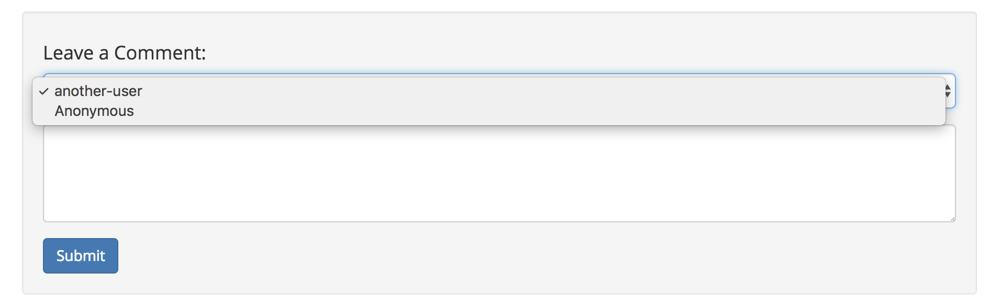
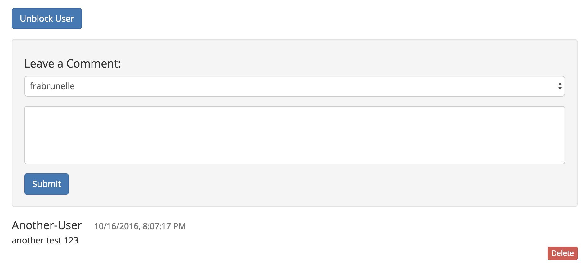

# Fetch public names

The plugin uses your list of public names to let you specify a name when you post a comment. You can also choose to post a comment as "Anonymous".

#### Contents

<!-- toc -->



## Fetch the public names of the user

The plugin fetches your [public names](https://api.safedev.org/dns/) and adds them to the UI.

#### [List long names](https://api.safedev.org/dns/list-long-names.html)

```
GET /dns
```

##### [controller.js](https://github.com/maidsafe/safe_examples/blob/19cb638c3f02a4b9b9492e44f1527f6010c8e9ba/permanent_comments_plugin/comments/src/controller.js#L460)

```js
window.safeDNS.listLongNames(this._authToken)
```

## Check if the user is the website owner

The plugin verifies that the current user is the website owner by comparing the public name of the current webpage to the public names owned by the user. If the public name of the current webpage is not contained in the list of public names owned by the user, it means that the user is not the owner of that webpage.

##### [controller.js](https://github.com/maidsafe/safe_examples/blob/19cb638c3f02a4b9b9492e44f1527f6010c8e9ba/permanent_comments_plugin/comments/src/controller.js#L81-L91)

```js
isAdmin () {
  if (this._isDevMode() && this._data.user.dns) {
    return true
  }

  let currentDns = this._hostName.split('.').slice(-1)[0]
  if (!this._data.user.dns) {
    return
  }
  return this._data.user.dns.indexOf(currentDns) !== -1
}
```

## Fetch the list of blocked users

If you are the website owner, the plugin tries to fetch the structured data that contains the list of blocked users for the current page. This list contains the public name of each blocked users along with their signing key. That way, you can [unblock a user](unblock-a-user.md) based on their public name.

If you haven't blocked any user yet, that structured data won't exist.

### Get a cipher options handle

The plugin fetches a cipher options handle for symmetric encryption. The structured data that contains the list of blocked users is encrypted using symmetric encryption because it only needs to be accessible by the website owner.

#### [Get cipher options handle](https://api.safedev.org/low-level-api/cipher-options/get-cipher-options-handle.html)

```
GET /cipher-opts/:encType/:keyHandle?
```

##### [controller.js](https://github.com/maidsafe/safe_examples/blob/19cb638c3f02a4b9b9492e44f1527f6010c8e9ba/permanent_comments_plugin/comments/src/controller.js#L325-L327)

```js
window.safeCipherOpts.getHandle(
    this._authToken,
    window.safeCipherOpts.getEncryptionTypes().SYMMETRIC)
```

### Get a data identifier handle

The plugin fetches a data identifier handle for the structured data that contains the list of blocked users for the current page.

#### [Get data ID handle](https://api.safedev.org/low-level-api/data-id/get-data-id-handle.html#for-structured-data)

```
POST /data-id/structured-data
```

##### [controller.js](https://github.com/maidsafe/safe_examples/blob/19cb638c3f02a4b9b9492e44f1527f6010c8e9ba/permanent_comments_plugin/comments/src/controller.js#L350-L351)

```js
window.safeDataId.getStructuredDataHandle(
  this._authToken, this._getLocation() + '_blocked_users', 500)
```

### Get a structured data handle

The plugin fetches a structured data handle using the data identifier handle of the structured data for blocked users.

#### [Get structured data handle](https://api.safedev.org/low-level-api/structured-data/get-structured-data-handle.html)

```
GET /structured-data/handle/:dataIdHandle
```

##### [controller.js](https://github.com/maidsafe/safe_examples/blob/19cb638c3f02a4b9b9492e44f1527f6010c8e9ba/permanent_comments_plugin/comments/src/controller.js#L353)

```js
window.safeStructuredData.getHandle(this._authToken, dataHandle)
```

### Drop the data identifier handle

The plugin drops the data identifier handle that represents the structured data for blocked users.

#### [Drop data ID handle](https://api.safedev.org/low-level-api/data-id/drop-data-id-handle.html)

```
DELETE /data-id/:handleId
```

##### [controller.js](https://github.com/maidsafe/safe_examples/blob/19cb638c3f02a4b9b9492e44f1527f6010c8e9ba/permanent_comments_plugin/comments/src/controller.js#L355)

```js
window.safeDataId.dropHandle(this._authToken, dataHandle)
```

### Fetch the structured data for blocked users

The plugin fetches the content of the structured data (the list of blocked users for the current page).

#### [Read structured data](https://api.safedev.org/low-level-api/structured-data/read-structured-data.html)

```
GET /structured-data/:handleId/:version?
```

##### [controller.js](https://github.com/maidsafe/safe_examples/blob/19cb638c3f02a4b9b9492e44f1527f6010c8e9ba/permanent_comments_plugin/comments/src/controller.js#L361-L363)

```js
window.safeStructuredData.readData(
    this._authToken,
    this._blockedUserStructureDataHandle)
```

If your list of blocked users contains at least one blocked user, an "Unblock User" button will appear:


