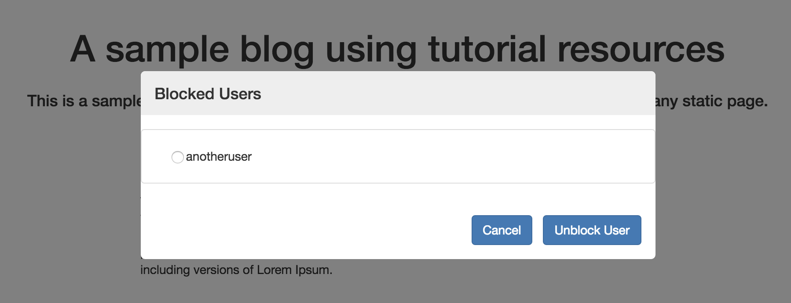

# Unblock a user

If you are the website owner, you can unblock users by removing their signing key from the appendable data associated with the current page.

#### Contents

<!-- toc -->



When you select a user to unblock, the plugin is able to retrieve the serialized signing key of that user from [the list of blocked users](fetch-public-names.md#fetch-the-list-of-blocked-users).

## Deserialize the signing key

The plugin deserializes the signing key of the user you want to unblock.

#### Deserialize signing key

```
POST /sign-key/deserialise
```

##### [controller.js](https://github.com/maidsafe/safe_examples/blob/19cb638c3f02a4b9b9492e44f1527f6010c8e9ba/permanent_comments_plugin/comments/src/controller.js#L271)

```js
window.safeSignKey.deserialise(this._authToken, new Buffer(this._data.blockedUsers[userName], 'base64'))
```

The API returns the handle ID for the signing key.

## Remove the signing key from the filter

The plugin removes the signing key of the user you want to unblock from the appendable data associated with the current page.

#### [Remove signing key from filter](https://github.com/maidsafe/rfcs/blob/master/text/0042-launcher-api-v0.6/api/appendable_data.md#delete-sign-keys-from-filter)

```
DELETE /appendable-data/filter/:handleId
```

##### [controller.js](https://github.com/maidsafe/safe_examples/blob/19cb638c3f02a4b9b9492e44f1527f6010c8e9ba/permanent_comments_plugin/comments/src/controller.js#L273-L276)

```js
window.safeAppendableData.removeFromFilter(
    this._authToken,
    this._currentPostHandleId,
    [signKeyHandle])
```

## Save the appendable data

The plugin updates the appendable data associated with the current page by sending a POST request to the SAFE Network.

#### [Save AppendableData](https://github.com/maidsafe/rfcs/blob/master/text/0042-launcher-api-v0.6/api/appendable_data.md#save-appendabledata)

```
POST /appendable-data/:handleId
```

##### [controller.js](https://github.com/maidsafe/safe_examples/blob/19cb638c3f02a4b9b9492e44f1527f6010c8e9ba/permanent_comments_plugin/comments/src/controller.js#L277-L278)

```js
window.safeAppendableData.post(
    this._authToken, this._currentPostHandleId)
```

## Update the structured data for blocked users

The plugin removes the serialized signing key of the user you just unblocked from the list of blocked users for the current page.

##### [controller.js](https://github.com/maidsafe/safe_examples/blob/19cb638c3f02a4b9b9492e44f1527f6010c8e9ba/permanent_comments_plugin/comments/src/controller.js#L280-L281)

```js
delete this._data.blockedUsers[userName]
const data = new Buffer(JSON.stringify(this._data.blockedUsers)).toString('base64')
```

### Update the structured data

The plugin updates the structured data with the new list of blocked users.

#### [Update structured data](https://api.safedev.org/low-level-api/structured-data/update-structured-data.html)

```
PATCH /structured-data/:handleId
```

##### [controller.js](https://github.com/maidsafe/safe_examples/blob/19cb638c3f02a4b9b9492e44f1527f6010c8e9ba/permanent_comments_plugin/comments/src/controller.js#L282-L285)

```js
window.safeStructuredData.updateData(
    this._authToken,
    this._blockedUserStructureDataHandle,
    data, this._symmetricCipherOptsHandle)
```

### Save the structured data

The plugin saves the structured data by sending a POST request to the SAFE Network.

#### [Save structured data](https://api.safedev.org/low-level-api/structured-data/save-structured-data.html#post-endpoint)

```
POST /structured-data/:handleId
```

##### [controller.js](https://github.com/maidsafe/safe_examples/blob/19cb638c3f02a4b9b9492e44f1527f6010c8e9ba/permanent_comments_plugin/comments/src/controller.js#L286-L287)

```js
window.safeStructuredData.post(
    this._authToken, this._blockedUserStructureDataHandle)
```

## Drop the handle for the signing key

The plugin drops the handle that represents the signing key of the user you just unblocked.

#### Drop handle

```
DELETE /sign-key/:handleId
```

##### [controller.js](https://github.com/maidsafe/safe_examples/blob/19cb638c3f02a4b9b9492e44f1527f6010c8e9ba/permanent_comments_plugin/comments/src/controller.js#L295)

```js
window.safeSignKey.dropHandle(this._authToken, signKeyHandle)
```

After the user has been unblocked, the plugin [reloads the comments](fetch-comments.md).
